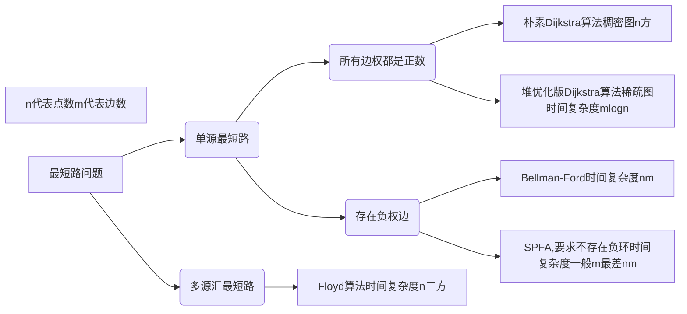
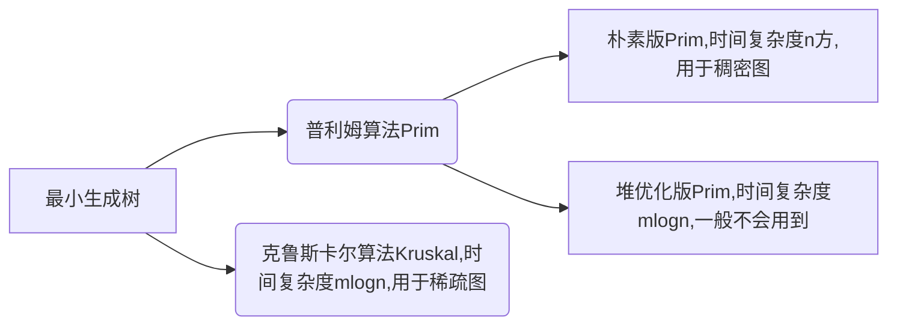
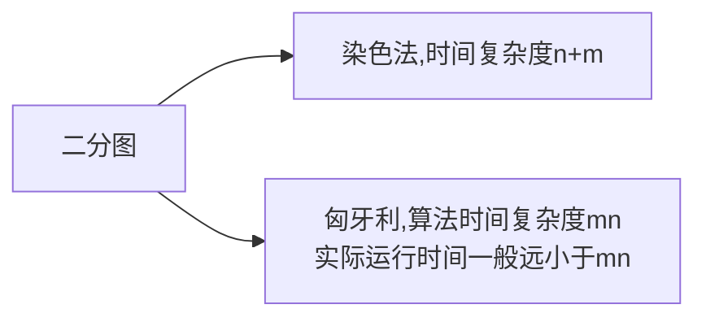

[toc]

# AcWing 算法基础课 -- 基础算法

包括排序、二分、高精度、前缀和与差分、双指针算法、位运算、离散化、区间合并等内容。

## 模板

### 快速排序

分治来实现，步骤如下：

1. 确定分届点
2. 调整区间，任意取一个x，小于等于的放左边，大于等于的放右边；**难点**
3. 递归处理左右两段

```java
import java.util.*;
import java.io.*;

public class Main{
    public static void main(String[] args) throws IOException{
        BufferedReader in = new BufferedReader(new InputStreamReader(System.in));
        int n = Integer.parseInt(in.readLine());
        int[] q = new int[n];
        String[] s = in.readLine().split(" ");
        for(int i = 0; i < n; i++){
            q[i] = Integer.parseInt(s[i]);
        }
        quickSort(q, 0, n - 1);
        for(int i = 0; i < n; i++){
            System.out.print(q[i] + " ");
        }
        in.close();
    }
    
    public static void quickSort(int[] q, int l, int r){
        if(l >= r) return; 
        int i = l - 1, j = r + 1, x = q[l + r >> 1];
        // 重点是循环结束的条件是左右指针相交
        while (i < j){
            do i++; while(q[i] < x);
            do j--; while(q[j] > x);
            if(i < j) {
                int t = q[i];
                q[i] = q[j];
                q[j] = t;
            }
        }
        quickSort(q, l, j);
        quickSort(q, j + 1, r);
    }
}
```
### 归并排序

1. 确定分界点，下标的中点
2. 递归排序
3. 归并，合二为一;**难点**


```java
import java.util.*;
import java.io.*;

public class Main{
    public static void main(String[] args) throws IOException{
        BufferedReader in = new BufferedReader(new InputStreamReader(System.in));
        int n = Integer.parseInt(in.readLine());
        int[] q = new int[n];
        int[] tmp = new int[n];
        String[] s = in.readLine().split(" ");
        for(int i = 0; i < n; i++){
            q[i] = Integer.parseInt(s[i]);
        }
        mergeSort(q, 0, n - 1, tmp);
        for(int num : q){
            System.out.print(num + " ");
        }
    }
    
    public static void mergeSort(int[] q, int l, int r, int[] tmp){
        if(l >= r) return;
        int mid = l + r >> 1;
        mergeSort(q, l, mid, tmp);
        mergeSort(q, mid + 1, r, tmp);
        int k = 0, i = l, j = mid + 1;
        while(i <= mid && j <= r){
            if(q[i] <= q[j]) tmp[k++] = q[i++];
            else tmp[k++] = q[j++];
        }
        while(i <= mid) tmp[k++] = q[i++];
        while(j <= r) tmp[k++] = q[j++];
        for(i = l, j = 0; i <= r; i++, j++) q[i] = tmp[j];
    }
}
```

### 整数二分

**这个模板没有大雪菜的精髓，但是我感觉比大雪菜的无脑。**不管是哪种变体，**循环条件都不变**，就里面的判断调整一下。

最简单的情况就是有序数组中不存在重复元素，也是各种二分变种的基础

```java
public int bsearch(int[] a, int n, int value) {
    int low = 0;
    int high = n - 1;

    while (low <= high) {
        int mid = (low + high) / 2;
        if (a[mid] == value) {
            return mid;
        } else if (a[mid] < value) {
            low = mid + 1;
        } else {
            high = mid - 1;
        }
    }

    return -1;
}
```

关键点：

- 循环条件是 low<=high
- mid = low + (high - low) / 2，防止溢出
- low = mid + 1, high = mid - 1,防止死循环

#### 变体一：查找第一个值等于给定值的元素

```java
public int bsearch(int[], int n, int value){
    int low = 0;
    int high = n - 1;
    while(low <= high){
        int mid = low + ((high - low) >> 1);
        if(a[mid] > value) high = mid - 1;
        else if (a[mid] < value) low = mid + 1;
        else {
            if((mid == 0) || (a[mid - 1] != value)) return mid;
            else high = mid - 1;
        }
    }
    return -1;
}
```

如果 mid 等于 0，那这个元素已经是数组的第一个元素，那它肯定是我们要找的；如果 mid 不等于 0，但 a[mid] 的前一个元素 a[mid-1] 不等于 value，那也说明 a[mid] 就是我们要找的第一个值等于给定值的元素。

如果经过检查之后发现 a[mid] 前面的一个元素 a[mid-1] 也等于 value，那说明此时的 a[mid] 肯定不是我们要查找的第一个值等于给定值的元素。那我们就更新 **high=mid-1**，因为要找的元素肯定出现在 [low, mid-1] 之间。

#### 变体二：查找最后一个值等于给定值的元素

```java
public int bsearch(int[], int n, int value){
    int low = 0;
    int high = n - 1;
    while(low <= high){
        int mid = low + ((high - low) >> 1);
        if(a[mid] > value) high = mid - 1;
        else if (a[mid] < value) low = mid + 1;
        else {
            if((mid == n - 1) || (a[mid + 1] != value)) return mid;
            else low = mid + 1;
        }
    }
    return -1;
}
```

如果 a[mid] 这个元素已经是数组中的最后一个元素了，那它肯定是我们要找的；如果 a[mid] 的后一个元素 a[mid+1] 不等于 value，那也说明 a[mid] 就是我们要找的最后一个值等于给定值的元素。

如果我们经过检查之后，发现 a[mid] 后面的一个元素 a[mid+1] 也等于 value，那说明当前的这个 a[mid] 并不是最后一个值等于给定值的元素。我们就更新 **low=mid+1**，因为要找的元素肯定出现在 [mid+1, high] 之间。

#### 变体三：查找第一个大于等于给定值的元素

```java
public int bsearch(int[], int n, int value){
    int low = 0;
    int high = n - 1;
    while(low <= high){
        int mid = low + ((high - low) >> 1);
        if(a[mid] >= value) {
            if((mid == 0) || (a[mid - 1] < value)) return mid;
            else high = mid - 1;
        }
        else {
            low = mid + 1;
        }
    }
    return -1;
}
```

如果 a[mid] 小于要查找的值 value，那要查找的值肯定在 [mid+1, high] 之间，所以，我们更新 low=mid+1。

对于 a[mid] 大于等于给定值 value 的情况，我们要先看下这个 a[mid] 是不是我们要找的第一个值大于等于给定值的元素。如果 a[mid] 前面已经没有元素，或者前面一个元素小于要查找的值 value，那 a[mid] 就是我们要找的元素。这段逻辑对应的代码是第 7 行。

如果 a[mid-1] 也大于等于要查找的值 value，那说明要查找的元素在 [low, mid-1] 之间，所以，我们将 high 更新为 mid-1。

#### 变体四：查找最后一个小于等于给定值的元素

```java
public int bsearch(int[], int n, int value){
    int low = 0;
    int high = n - 1;
    while(low <= high){
        int mid = low + ((high - low) >> 1);
        if(a[mid] <= value) {
            if((mid == n - 1) || (a[mid + 1] > value)) return mid;
            else low = mid + 1;
        }
        else {
            high = mid - 1;
        }
    }
    return -1;
}
```

对于 a[mid] 小于等于给定值 value 的情况，我们要先看下这个 a[mid] 是不是我们要找的第一个值大于等于给定值的元素。如果 a[mid] 后面已经没有元素，或者后面一个元素大于要查找的值 value，那 a[mid] 就是我们要找的元素。

如果 a[mid+1] 也小于等于要查找的值 value，那说明要查找的元素在 [mid+1, high] 之间，所以，我们将 low 更新为 mid+1。

如果 a[mid] 大于要查找的值 value，那要查找的值肯定在 [low, mid-1] 之间，所以，我们更新 high=mid-1。

### 浮点数二分

浮点数二分比整数二分简单，因为就不需要判断边界了

以 AcWing 790. 数的三次方根 为例
```java
import java.io.*;

public class Main{
    public static void main(String[] args) throws IOException{
        final double ACC = 1e-8;
        BufferedReader in = new BufferedReader(new InputStreamReader(System.in));
        double x = Double.parseDouble(in.readLine());
        double l = -100, r = 100;
        while(r - l > ACC){
            double mid = (l + r) / 2;
            if(mid * mid * mid >= x) r = mid;
            else l = mid;
        }
        System.out.printf("%.6f", r);
    }
}
```
### 高精度加法

AcWing 791. 高精度加法

1. 用BitInteger来处理

```java
import java.math.BigInteger;
import java.io.*;

public class Main {

    public static void main(String[] args) throws IOException {
        BufferedReader in = new BufferedReader(new InputStreamReader(System.in));
        BigInteger a = new BigInteger(in.readLine());
        BigInteger b = new BigInteger(in.readLine());
        System.out.println(a.add(b));
        
    }

}
```

2. 用字符串形式来，会比BigInteger的时间快一倍

```java
import java.util.*;
import java.io.*;

public class Main{
    public static void main(String[] args) throws IOException{
        BufferedReader in = new BufferedReader(new InputStreamReader(System.in));
        // 字符串读取两个数字
        String a = in.readLine(), b = in.readLine();
        // 用数组保存数字，数组的0位对应数字的个位，所以倒序遍历字符串
        List<Integer> x = new ArrayList<>();
        List<Integer> y = new ArrayList<>();
        for(int i = a.length() - 1; i >= 0; i--) x.add(a.charAt(i) - '0');
        for(int i = b.length() - 1; i >= 0; i--) y.add(b.charAt(i) - '0');
        // 用栈来存储，存的话先存个位，打印的话先打印高位
        Deque<Integer> c = new ArrayDeque<>();
        c = add(x, y);
        while(!c.isEmpty()){
            System.out.print(c.pop());
        }
    }
    // 人为规定 x > y
    public static Deque<Integer> add(List<Integer> x, List<Integer> y){
        if(x.size() < y.size()) return add(y, x);
        Deque<Integer> c =new ArrayDeque<>();
        // t 记录进位
        int t = 0;
        for(int i = 0; i < x.size(); i++){
            t += x.get(i);
            if(i < y.size()) t += y.get(i);
            c.push(t % 10);
            t = t / 10;
        }
        // 最后还有一个进位，别忽略
        if(t > 0) c.push(t);
        return c;
    }
}
```

### 高精度减法

AcWing 792. 高精度减法

```java
import java.util.*;
import java.io.*;

public class Main{
    public static void main(String[] args) throws IOException{
        BufferedReader in = new BufferedReader(new InputStreamReader(System.in));
        // 字符串读取两个数字
        String a = in.readLine(), b = in.readLine();
        // 用数组保存数字，数组的0位对应数字的个位，所以倒序遍历字符串
        List<Integer> x = new ArrayList<>();
        List<Integer> y = new ArrayList<>();
        for(int i = a.length() - 1; i >= 0; i--) x.add(a.charAt(i) - '0');
        for(int i = b.length() - 1; i >= 0; i--) y.add(b.charAt(i) - '0');
        // 用栈来存储，存的话先存个位，打印的话先打印高位
        Deque<Integer> c = new ArrayDeque<>();
        // 如果 x 大于等于 y， 就用 x - y
        // 如果 x 小于 y，先打印负号，再计算 y - x
        if(cmp(x, y)) c = sub(x, y);
        else{
            System.out.print("-");
            c = sub(y, x);
        }
        while(!c.isEmpty()){
            System.out.print(c.pop());
        }
    }
    public static boolean cmp(List<Integer> x, List<Integer> y){
        if(x.size() != y.size()) return x.size() > y.size();
        for(int i = x.size() - 1; i >= 0; i--){
            if(x.get(i) != y.get(i)) return x.get(i) > y.get(i);
        }
        return true;
    }
    public static Deque<Integer> sub(List<Integer> x, List<Integer> y){
        Deque<Integer> c =new ArrayDeque<>();
        // t 记录借位
        int t = 0;
        for(int i = 0; i < x.size(); i++){
            t = x.get(i) - t;
            if(i < y.size()) t = t - y.get(i);
            c.push((t + 10) % 10);
            // 如果 t 为负数，就借一位，否则不用借位
            t = t < 0 ? 1 : 0;
        }
        // 去除前导 0
        while( c.size() > 1 && c.peek() == 0) c.pop();
        return c;
    }
}
```

### 高精度乘低精度
### 高精度除以低精度
### 一维前缀和

AcWing 795. 前缀和 

```java
import java.util.*;
import java.io.*;

public class Main{
    public static void main(String[] args) throws IOException{
        BufferedReader in = new BufferedReader(new InputStreamReader(System.in));
        String[] s = in.readLine().split(" ");
        int n = Integer.parseInt(s[0]);
        int m = Integer.parseInt(s[1]);
        s = in.readLine().split(" ");
        int[] a = new int[n];
        int[] p = new int[n + 1];
        // 计算前缀和：前i个元素的前缀和
        // 下标领先一个数组小标，为了表示出前 0 个前缀和为 0
        for(int i = 0; i < n; i++){
            a[i] = Integer.parseInt(s[i]);
            p[i + 1] = p[i] + a[i];
        }
        while(m>0){
            m--;
            s = in.readLine().split(" ");
            int l = Integer.parseInt(s[0]);
            int r = Integer.parseInt(s[1]);
            System.out.println(p[r] - p[l - 1]);
        }
    }
}
```

### 二维前缀和

AcWing 796. 子矩阵的和 

```java
import java.util.*;
import java.io.*;

public class Main{
    public static void main(String[] args) throws IOException{
        BufferedReader in = new BufferedReader(new InputStreamReader(System.in));
        String[] s = in.readLine().split(" ");
        int n = Integer.parseInt(s[0]);
        int m = Integer.parseInt(s[1]);
        int q = Integer.parseInt(s[2]);
        int[][] a = new int[n][m];
        int[][] p = new int[n + 1][m + 1];
        for(int i = 0; i < n; i++){
            s = in.readLine().split(" ");
            for(int j = 0; j < m; j++){
                a[i][j] = Integer.parseInt(s[j]);
                p[i + 1][j + 1] = a[i][j] + p[i][j + 1] + p[i + 1][j] - p[i][j];
            }
        }
        while(q > 0){
            q--;
            s = in.readLine().split(" ");
            int x1 = Integer.parseInt(s[0]);
            int y1 = Integer.parseInt(s[1]);
            int x2 = Integer.parseInt(s[2]);
            int y2 = Integer.parseInt(s[3]);
            System.out.println(p[x2][y2] - p[x2][y1 - 1] - p[x1 - 1][y2] + p[x1 - 1][y1 - 1]);
        }
    }
}
```

### 一维差分

AcWing 算法基础课 -- 基础算法

```java
import java.util.*;
import java.io.*;

public class Main{
    public static void main(String[] args) throws IOException{
        BufferedReader in = new BufferedReader(new InputStreamReader(System.in));
        String[] s = in.readLine().split(" ");
        // 整数序列 n 个整数
        int n = Integer.parseInt(s[0]);
        // m 个插入操作
        // 插入操作对于数组的索引是从 1 开始的
        // 所以建立差分数组也是从从 1 开始，比较不容易出错
        int m = Integer.parseInt(s[1]);
        s = in.readLine().split(" ");
        int[] a = new int[n + 10];
        for(int i = 1; i <= n; i++){
            int c = Integer.parseInt(s[i - 1]);
            // 插入 c
            insert(a, i, i, c);
        }
        while(m > 0){
            m--;
            s = in.readLine().split(" ");
            int l = Integer.parseInt(s[0]);
            int r = Integer.parseInt(s[1]);
            int c = Integer.parseInt(s[2]);
            insert(a, l, r, c);
        }
        for(int i = 1; i <= n; i++){
            a[i] += a[i - 1];
            System.out.print(a[i] + " ");
        }
        
    }
    
    public static void insert(int[] a, int l, int r, int c){
        a[l] += c;
        a[r + 1] -= c;
    }
    
}
```

### 二维差分

AcWing 798. 差分矩阵

```java
import java.util.*;
import java.io.*;

public class Main{
    public static void main(String[] args) throws IOException{
        BufferedReader in = new BufferedReader(new InputStreamReader(System.in));
        BufferedWriter out = new BufferedWriter(new OutputStreamWriter(System.out)); 
        String[] s = in.readLine().split(" ");
        int n = Integer.parseInt(s[0]);
        int m = Integer.parseInt(s[1]);
        int q = Integer.parseInt(s[2]);
        int[][] a = new int[n + 10][m + 10];
        int[][] b = new int[n + 10][m + 10];
        for(int i = 1; i <= n; i++){
            s = in.readLine().split(" ");
            for(int j = 1; j <= m; j++){
                int c = Integer.parseInt(s[j - 1].trim());
                insert(a, i, j, i, j, c);
            }
        }
        while(q > 0){
            q--;
            s = in.readLine().split(" ");
            int x1 = Integer.parseInt(s[0]);
            int y1 = Integer.parseInt(s[1]);
            int x2 = Integer.parseInt(s[2]);
            int y2 = Integer.parseInt(s[3]);
            int c = Integer.parseInt(s[4]);
            insert(a, x1, y1, x2, y2, c);
        }
        for(int i = 1; i <= n; i++){
            for(int j = 1; j <= m; j++){
                b[i][j] = a[i][j] + b[i - 1][j] + b[i][j - 1] - b[i - 1][j - 1];
                // 如果不是以字符串的形式输出，就输出不了数字
                out.write(b[i][j] + " ");
                if(j == m){
                    out.write("\n");
                }
                
            }
            out.flush();

        }
        
    }
    public static void insert(int[][] a, int x1, int y1, int x2, int y2, int c){
        a[x1][y1] += c;
        a[x2 + 1][y1] -= c;
        a[x1][y2 + 1] -= c;
        a[x2 + 1][y2 + 1] += c;
    }
}
```
### 双指针算法

AcWing 799. 最长连续不重复子序列

```java
import java.util.*;
import java.io.*;

public class Main{
    public static void main(String[] args) throws IOException{
        BufferedReader in = new BufferedReader(new InputStreamReader(System.in));
        BufferedWriter out = new BufferedWriter(new OutputStreamWriter(System.out));
        int n = Integer.parseInt(in.readLine());
        String[] s = in.readLine().split(" ");
        int[] a = new int[n + 10];
        for(int i = 0; i < n; i++){
            a[i] = Integer.parseInt(s[i]);
        }
        int[] q = new int[100010];
        int res = 0;
        // 区间 [i, j] 为不包含重复元素的区间
        // 遍历每一个元素，找到以该元素为结尾的最长不重复字符串
        // 当结尾元素往后移
        // 1. 如果出现了重复字符，开始元素往后移动
        // 2. 如果没有出现重复元素，开始元素不动
        // 可以发现开始元素的移动具有单调性
        // 这种场景适合双指针
        for(int i = 0, j = 0; j < n; j++){
            q[a[j]]++;
            while(i < j && q[a[j]] > 1){
                q[a[i]]--;
                i++;
            }
            res = Math.max(res, j - i + 1);
        }
        out.write(String.valueOf(res));
        out.flush();
    }
}
```

### 位运算

1. 求 n 的第 k 为数字： `n >> k & 1`
2. 返回 x 的最后一位 1：lowbit(x)原理：`x & -x`;x & -x 其实就是 x & (~x + 1)`

AcWing 801. 二进制中1的个数 

```java
import java.util.*;
import java.io.*;

public class Main{
    public static void main(String[] args) throws IOException{
        BufferedReader in = new BufferedReader(new InputStreamReader(System.in));
        BufferedWriter out = new BufferedWriter(new OutputStreamWriter(System.out));
        int n = Integer.parseInt(in.readLine());
        String[] s = in.readLine().split(" ");
        
        for(int i = 0; i < n; i++){
            int x = Integer.parseInt(s[i]);
            int res = 0;
            while(x > 0) {
                x = x - (x & -x);
                res++;
            }
            out.write(res + " ");
            out.flush();
            // System.out.print(res + " ");
        }
        
    }
}
```

### 离散化

1. 数组 a 有重复元素，**去重**
   1. 排序
   2. 利用unique函数把不重复元素移到数组前面。unique判定要满足两个性质：1. 第一个元素，2. 和前一个元素不相同
2. 如何快速算出 x 离散化后的值：**二分**

AcWing 802. 区间和 

```java
import java.util.*;
import java.io.*;

public class Main{
    static class Pairs{
        int first, second;
        public Pairs(int first, int second){
            this.first = first;
            this.second = second;
        }
    }
    public static void main(String[] args) throws IOException{
        BufferedReader in = new BufferedReader(new InputStreamReader(System.in));
        BufferedWriter out = new BufferedWriter(new OutputStreamWriter(System.out));
        String[] s = in.readLine().split(" ");
        int n = Integer.parseInt(s[0]);
        int m = Integer.parseInt(s[1]);
        // 数据范围为 10 的 9 次方,如果直接一个数组来存,空间就会超出限制
        // 但是操作数和查询数只有 10 的 5 次方
        // 想到用离散化的方式,用 10 的 5 次方的长度表示 10 的 9 次方的量级
        // 申请的数组长度 n + m + m + 10 就可以,加个 10 防止边界问题
        int N = n + m + m + 10;
        // a[] 去重,离散化之后的数组
        int[] a = new int[N];
        // p[] a的前缀和
        int[] p = new int[N];
        // adds 记录添加操作
        List<Pairs> adds = new ArrayList<>();
        // querys 记录查询操作
        List<Pairs> querys = new ArrayList<>();
        // alls 记录所有在数轴上出现过的坐标
        List<Integer> alls = new ArrayList<>();
        for(int i = 0; i < n; i++){
            s = in.readLine().split(" ");
            int x = Integer.parseInt(s[0]);
            int c = Integer.parseInt(s[1]);
            adds.add(new Pairs(x, c));
            alls.add(x);
        }
        
        for(int i = 0; i < m; i++){
            s = in.readLine().split(" ");
            int l = Integer.parseInt(s[0]);
            int r = Integer.parseInt(s[1]);
            
            querys.add(new Pairs(l, r));
            alls.add(l);
            alls.add(r);
        }
        // 排序
        Collections.sort(alls);
        // 去重
        int end = unique(alls);
        alls = alls.subList(0, end);

        // 离散化,就是找到要插入或者查询的数字在 alls 的位置
        // 可以用二分查找
        // 插入
        // 返回值以 1 开始计数
        for(int i = 0; i < n; i++){
            int index = bsearch(adds.get(i).first, alls);
            a[index] += adds.get(i).second;
        }

        // 计算前缀和
        for(int i = 1; i < N; i++){
            p[i] = p[i - 1] + a[i];
        }

        // 开始查询输出
        for(int i = 0; i < m; i++){
            int l = bsearch(querys.get(i).first, alls);
            int r = bsearch(querys.get(i).second, alls);
            int res = p[r] - p[l - 1];
            out.write(res + "\n");
            out.flush();
        }
    }
    public static int unique(List<Integer> list){
        int j = 0;
        for(int i = 0; i < list.size(); i++){
            if(i == 0 || list.get(i) != list.get(i - 1)){
                list.set(j, list.get(i));
                j++;
            }
        }
        return j;
    }
    public static int bsearch(int x, List<Integer> list){
        int l = 0, r = list.size() - 1;
        while(l <= r){
            int mid = l + r >> 1;
            if(list.get(mid) > x) r = mid - 1;
            else if(list.get(mid) < x) l = mid + 1;
            else return mid + 1;
        }
        return 1;
    }
}
```

### 区间合并

AcWing 803. 区间合并

```java
import java.util.*;
import java.io.*;

public class Main{
    public static class Pairs{
        int l, r;
        public Pairs(int l, int r){
            this.l = l;
            this.r = r;
        }
    }
    public static void main(String[] args) throws IOException{
        BufferedReader in = new BufferedReader(new InputStreamReader(System.in));
        int n = Integer.parseInt(in.readLine());
        List<Pairs> alls = new ArrayList<>();
        for(int i = 0; i < n; i++){
            String[] s = in.readLine().split(" ");
            int l = Integer.parseInt(s[0]);
            int r = Integer.parseInt(s[1]);
            alls.add(new Pairs(l, r));
        }
        // 利用 lambda 表达式重写比较器
        // 根据 左边界 升序排列
        Collections.sort(alls, (Pairs a1, Pairs a2) -> a1.l - a2.l);
        int res = 1;
        Pairs p = new Pairs(alls.get(0).l, alls.get(0).r);
        for(int i = 1; i < n; i++){
            int l = alls.get(i).l;
            int r = alls.get(i).r;
            if(l > p.r){
                res++;
                p.l = alls.get(i).l;
                p.r = alls.get(i).r;
            }
            else{
                if(r > p.r){
                    p.r = alls.get(i).r;
                }
            }
        }
        System.out.println(res);
    }
}
```
# AcWing 算法基础课 -- 数据结构

## 模板

参考 AcWing [https://www.acwing.com/blog/content/404/](https://www.acwing.com/blog/content/404/)

### 单链表 —— 模板题 AcWing 826. 单链表

1. AcWing数组模拟单链表

```cpp
// head存储链表头，e[]存储节点的值，ne[]存储节点的next指针，idx表示当前用到了哪个节点
int head, e[N], ne[N], idx;

// 初始化
void init()
{
    head = -1;
    idx = 0;
}

// 在链表头插入一个数a
void insert(int a)
{
    e[idx] = a, ne[idx] = head, head = idx ++ ;
}

// 将头结点删除，需要保证头结点存在
void remove()
{
    head = ne[head];
}
```
2. 模板题 Java 题解

```java
import java.util.*;
import java.io.*;

public class Main{
    public static int N = 100010;
    public static int[] e = new int[N];
    public static int[] ne = new int[N];
    public static int head = 0;
    public static int idx = 1;
    public static void main(String[] args) throws IOException{
        BufferedReader in = new BufferedReader(new InputStreamReader(System.in));
        int m = Integer.parseInt(in.readLine());
        while(m > 0){
            m--;
            String[] s = in.readLine().split(" ");
            if(s[0].equals("H")){
                int x = Integer.parseInt(s[1]);
                addHead(x);
            }else if(s[0].equals("D")){
                int k = Integer.parseInt(s[1]);
                remove(k);
            }else{
                int k = Integer.parseInt(s[1]);
                int x = Integer.parseInt(s[2]);
                add(k, x);
            }
        }
        for(int i = head; i != 0; i = ne[i]) System.out.print(e[i] + " ");
        
    }
    public static void addHead(int x){
        // 先记录 idx 的值
        // 然后让 idx 指向头结点指向的结点
        // 修改头结点的指向为 idx
        // idx 加 1
        e[idx] = x;
        ne[idx] = head;
        head = idx;
        idx++;
    }
    public static void remove(int k){
        // 如果 k 为 0，删除头结点
        if(k == 0)  head = ne[head];
        // 第 k 个结点指向 next 的 next
        else    ne[k] = ne[ne[k]];
    }
    public static void add(int k, int x){
        // 先记录 idx 的值
        // 然后让 idx 指向第 k 指向的结点
        // 修改第 k 个结点的指向为 idx
        // idx 加 1
        e[idx] = x;
        ne[idx] = ne[k];
        ne[k] = idx;
        idx++;
    }
}
```

### 双链表 —— 模板题 AcWing 827. 双链表

1. AcWing数组模拟双链表模板

```cpp
// e[]表示节点的值，l[]表示节点的左指针，r[]表示节点的右指针，idx表示当前用到了哪个节点
int e[N], l[N], r[N], idx;

// 初始化
void init()
{
    //0是左端点，1是右端点
    r[0] = 1, l[1] = 0;
    idx = 2;
}

// 在节点a的右边插入一个数x
void insert(int a, int x)
{
    e[idx] = x;
    l[idx] = a, r[idx] = r[a];
    l[r[a]] = idx, r[a] = idx ++ ;
}

// 删除节点a
void remove(int a)
{
    l[r[a]] = l[a];
    r[l[a]] = r[a];
}
```

2. 模板题 Java 解答

```java
import java.util.*;
import java.io.*;

public class Main{
    public static final int N = 100010;
    public static int[] e = new int[N];
    public static int[] l = new int[N];
    public static int[] r = new int[N];
    public static int idx;
    // 规定双向链表的头的位置（最左侧）为0，尾的位置（最右侧）为 100005
    // 插入的第 1 个结点只能从 1 开始
    public static void main(String[] args) throws IOException{
        BufferedReader in = new BufferedReader(new InputStreamReader(System.in));
        int m = Integer.parseInt(in.readLine());
        init();
        int x, k;
        while(m > 0){
            m--;
            String[] s = in.readLine().split(" ");  
            switch(s[0]){
                case "L" :
                    // 在链表最左端插入数 x
                    // 也就是在头结点的右边插入数 x
                    x = Integer.parseInt(s[1]);
                    add(0, x);
                    break;
                case "R" :
                    // 在链表的最右端插入数 x
                    // 也就是在尾结点的左边插入数 x
                    x = Integer.parseInt(s[1]);
                    add(l[100005], x);
                    break;
                case "D" :
                    // 将第 k 个插入的数删除
                    k = Integer.parseInt(s[1]);
                    remove(k);
                    break;
                case "IL" :
                    // 在第 k 个插入的数左侧插入一个数字
                    k = Integer.parseInt(s[1]);
                    x = Integer.parseInt(s[2]);
                    add(l[k], x);
                    break;
                case "IR" :
                    // 在第 k 个插入的数右侧插入一个数字
                    k = Integer.parseInt(s[1]);
                    x = Integer.parseInt(s[2]);
                    add(k, x);
                    break;
            }
        }
        for(int i = r[0]; i != 100005; i = r[i]){
            System.out.print(e[i] + " ");
        }
    }
    public static void init(){
        r[0] = 100005;
        l[100005] = 0;
        idx = 1;
    }
    public static void add(int k, int x){
        e[idx] = x;
        r[idx] = r[k];
        l[idx] = k;
        l[r[k]] = idx;
        r[k] = idx;
        idx++;
        
    }
    public static void remove(int k){
        r[l[k]] = r[k];
        l[r[k]] = l[k];
    }
}
```

### 栈 —— 模板题 AcWing 828. 模拟栈

1. 数组模拟栈

```cpp
// tt表示栈顶
int stk[N], tt = 0;

// 向栈顶插入一个数
stk[ ++ tt] = x;

// 从栈顶弹出一个数
tt -- ;

// 栈顶的值
stk[tt];

// 判断栈是否为空
if (tt > 0)
{

}
```

2. 模板题 Java 题解

```java
import java.util.*;
import java.io.*;

public class Main{
    public static final int N = 100010;
    public static int[] stk = new int[N];
    public static int tt = 0;
    public static void main(String[] args) throws IOException{
        BufferedReader in = new BufferedReader(new InputStreamReader(System.in));
        int m = Integer.parseInt(in.readLine());
        while(m > 0){
            m--;
            String[] s = in.readLine().split(" ");
            if(s[0].equals("push")){
                int x = Integer.parseInt(s[1]);
                stk[tt] = x;
                tt++;
            }else if(s[0].equals("pop")){
                tt--;
            }else if(s[0].equals("empty")){
                String res = tt == 0 ? "YES" : "NO";
                System.out.println(res);
            }else if(s[0].equals("query")){
                System.out.println(stk[tt - 1]);
            }
        }
    }
}
```

3. 表达式求值

```java
import java.util.*;

class Main{
    public static void main(String[] args) {
        Scanner sc = new Scanner(System.in);
        String s = sc.nextLine();
        int n = s.length();
        Deque<Integer> num = new LinkedList<>();
        Deque<Character> op = new LinkedList<>();
        Map<Character, Integer> pr = new HashMap<>();
        pr.put('+', 1);
        pr.put('-', 1);
        pr.put('*', 2);
        pr.put('/', 2);
        for(int i = 0; i < n; i++) {
            char c = s.charAt(i);
            if(c == ' ') continue;
            else if(Character.isDigit(c)) {
                int j = i, x = 0;
                while(j < n && Character.isDigit(s.charAt(j))) {
                    x = x * 10 + (s.charAt(j) - '0');
                    j++;
                }
                num.push(x);
                i = j - 1;
            }
            else if(c == '(') op.push(c);
            else if(c == ')') {
                while(op.peek() != '(') cal(num, op);
                op.pop();
            }
            else {
                while(!op.isEmpty() && op.peek() != '(' && pr.get(op.peek()) >= pr.get(c)) cal(num, op);
                op.push(c);
            }
        }
        while(!op.isEmpty()) cal(num, op);
        System.out.println(num.pop());
    }
    public static void cal(Deque<Integer> num, Deque<Character> op) {
        int b = num.pop();
        int a = num.pop();
        char c = op.pop();
        int x = 0;
        if (c == '+') x = a + b;
        else if (c == '-') x = a - b;
        else if (c == '*') x = a * b;
        else x = a / b;
        num.push(x);
    }
}
```

### 队列 —— 模板题 AcWing 829. 模拟队列

1. 数组模拟普通队列

```cpp
// hh 表示队头，tt表示队尾
int q[N], hh = 0, tt = -1;

// 向队尾插入一个数
q[ ++ tt] = x;

// 从队头弹出一个数
hh ++ ;

// 队头的值
q[hh];

// 判断队列是否为空
if (hh <= tt)
{

}
```

2. 数组模拟循环队列

```cpp
// hh 表示队头，tt表示队尾的后一个位置
int q[N], hh = 0, tt = 0;

// 向队尾插入一个数
q[tt ++ ] = x;
if (tt == N) tt = 0;

// 从队头弹出一个数
hh ++ ;
if (hh == N) hh = 0;

// 队头的值
q[hh];

// 判断队列是否为空
if (hh != tt)
{

}
```

3. 模板题 Java 题解

```java
import java.util.*;
import java.io.*;

public class Main{
    public static final int N = 100010;
    public static int[] q = new int[N];
    public static int idx = 0;
    // hh 表示队头
    // tt 表示队尾
    // 队列队尾插入数据,队首弹出数据
    // hh 和 tt 的初始化要注意是 0 还是 -1,不同的初始化在 push 操作是不一样的,自己画图推导一下
    public static int hh = 0, tt = 0;
    public static void main(String[] args) throws IOException{
        BufferedReader in = new BufferedReader(new InputStreamReader(System.in));
        int m = Integer.parseInt(in.readLine());
        while(m > 0){
            m--;
            String[] s = in.readLine().split(" ");
            if(s[0].equals("push")){
                q[tt] = Integer.parseInt(s[1]);
                tt++;
            }else if(s[0].equals("pop")){
                hh++;
            }else if(s[0].equals("empty")){
                String res = hh < tt ? "NO" : "YES";
                System.out.println(res);
            }else if(s[0].equals("query")){
                System.out.println(q[hh]);
            }
        }
    }
}
```

### 单调栈 —— 模板题 AcWing 830. 单调栈

**单调栈常用题型**：各一个序列，在序列中每一个数的左边离他最近的最大的数字在什么地方，这个左边右边、最大最小是一个意思。

1. 单调栈模板

用数组

```cpp
// 常见模型：找出每个数左边离它最近的比它大/小的数
int tt = 0;
for (int i = 1; i <= n; i ++ )
{
    while (tt && check(stk[tt], i)) tt -- ;
    stk[ ++ tt] = i;
}
```

用 Deque

```java
for(int i = 0; i < n; i++) {
    while(!dq.isEmpty() && a[dq.peek()] >= a[i]) dq.pop();
    dq.push(i);
}
```


2. 模板题 Java 解答

用数组

```java
import java.util.*;
import java.io.*;

public class Main{
    public static void main(String[] args) throws IOException{
        int N = 100010;
        int[] stk = new int[N];
        int tt = 0;
        BufferedReader in = new BufferedReader(new InputStreamReader(System.in));
        int n = Integer.parseInt(in.readLine());
        String[] s = in.readLine().split(" ");
        for(int i = 0; i < n; i++){
            int x = Integer.parseInt(s[i]);
            while(tt > 0 && stk[tt] >= x) tt--;
            if(tt > 0) System.out.print(stk[tt] + " ");
            else System.out.print(-1 + " ");
            tt++;
            stk[tt] = x;
        }
    }
}
```

用 Deque

```java
import java.util.*;
import java.io.*;

 class Main{
     public static void main(String[] args) throws IOException{
        BufferedReader br = new BufferedReader(new InputStreamReader(System.in));
        BufferedWriter bw = new BufferedWriter(new OutputStreamWriter(System.out));
        String[] s = br.readLine().split(" ");
        int n = Integer.parseInt(s[0]);
        int[] a = new int[n + 10];
        s = br.readLine().split(" ");
        for(int i = 0; i < n; i++) {
            a[i] = Integer.parseInt(s[i]);
        }
        Deque<Integer> dq = new LinkedList<>();
        for(int i = 0; i < n; i++) {
            while(!dq.isEmpty() && a[dq.peek()] >= a[i]) dq.pop();
            if(!dq.isEmpty()) bw.write(a[dq.peek()] + " ");
            else bw.write(-1 + " ");
            dq.push(i);
        }
        bw.close();
        br.close();
     }
     
 }
```

### 单调队列 —— 模板题 AcWing 154. 滑动窗口

1. 单调队列模板

- 注意 hh 和 tt 的初始化
- 队列里存储的是下标

```cpp
// 常见模型：找出滑动窗口中的最大值/最小值
int hh = 0, tt = -1;
for (int i = 0; i < n; i ++ )
{
    // 判断队头是否需要滑出窗口
    // 队列不空 且 满足弹出条件
    if (hh <= tt && check_out(q[hh])) hh ++ ; 
    // 判断队尾元素是否需要弹出
    while (hh <= tt && check(q[tt], i)) tt -- ;
    q[ ++ tt] = i;
}
```

用 Deque 来

```java
// 滑动窗口最小值
Deque<Integer> q = new LinkedList<>();
for(int i = 0; i < n; i++) {
    if(!q.isEmpty() && q.peekFirst() <= i - k) q.pollFirst();
    while(!q.isEmpty() && a[q.peekLast()] >= a[i]) q.pollLast(); 
    q.offerLast(i);
    if(i >= k - 1) bw.write(a[q.peekFirst()] + " ");
}
```

2. 模板题 Java 题解

用数组

```java
import java.util.*;
import java.io.*;

public class Main{
    public static void main(String[] args) throws IOException{
        BufferedReader in = new BufferedReader(new InputStreamReader(System.in));
        String[] s = in.readLine().split(" ");
        int n = Integer.parseInt(s[0]);
        int k = Integer.parseInt(s[1]);
        // 数组 a 保存原始数据
        int[] a = new int[n + 10];
        // 数组 q 保存每一个滑动窗口处理之后的严格单调队列元素的下标
        // 注意 保存的是下标
        int[] q = new int[n + 10];
        s = in.readLine().split(" ");
        for(int i = 0; i < n; i++){
            a[i] = Integer.parseInt(s[i]);
        }
        // 1. 找滑动窗口的最小值
        // 滑动窗口的队列：队尾插入，队首弹出
        // hh 代表队首，tt 代表队尾
        // 分别初始化为 0 和 -1，保证滑动窗口为空的时候 tt < hh
        int hh = 0, tt = -1;
        for(int i = 0; i < n; i++){
            // 判断是否需要弹出队首元素
            // 当窗口队列不为空 且 当前下标和队首元素下标的差值大于 k - 1
            if(hh <= tt && i - q[hh] > k - 1) hh++;
            // 从队尾开始,弹出不大于当前元素的值
            while(hh <= tt && a[q[tt]] >= a[i]) tt--;
            // 插入当前元素
            tt++;
            q[tt] = i;
            // 队首元素即是当前窗口的最大值,打印出来
            // 当窗口元素个数达到 k 个时再输出
            if(i >= k - 1) System.out.print(a[q[hh]] + " ");
        }
        System.out.println();
        // 2. 找滑动窗口的最大值
        hh = 0;
        tt = -1;
        for(int i = 0; i < n; i++){
            if(hh <= tt && i - q[hh] > k - 1)  hh++;
            while(hh <= tt && a[q[tt]] <= a[i]) tt--;
            tt++;
            q[tt] = i;
            if(i >= k - 1) System.out.print(a[q[hh]] + " ");
        }
        System.out.println();
    }
}
```

用 Deque

```java
import java.util.*;
import java.io.*;

 class Main{
    public static void main(String[] args) throws IOException{
        BufferedReader br = new BufferedReader(new InputStreamReader(System.in));
        BufferedWriter bw = new BufferedWriter(new OutputStreamWriter(System.out));
        String[] s = br.readLine().split(" ");
        int n = Integer.parseInt(s[0]);
        int k = Integer.parseInt(s[1]);
        int[] a = new int[n + 10];
        s = br.readLine().split(" ");
        for(int i = 0; i < n; i++) {
            a[i] = Integer.parseInt(s[i]);
        }
        // 滑动窗口最小值
        Deque<Integer> q = new LinkedList<>();
        for(int i = 0; i < n; i++) {
            if(!q.isEmpty() && q.peekFirst() <= i - k) q.pollFirst();
            while(!q.isEmpty() && a[q.peekLast()] >= a[i]) q.pollLast(); 
            q.offerLast(i);
            if(i >= k - 1) bw.write(a[q.peekFirst()] + " ");
        }
    
        bw.write("\n");
        q = new LinkedList<>();
        for(int i = 0; i < n; i++) {
            if(!q.isEmpty() && q.peekFirst() <= i - k) q.pollFirst();
            while(!q.isEmpty() && a[q.peekLast()] <= a[i]) q.pollLast();
            q.offerLast(i);
            if(i >= k - 1) bw.write(a[q.peekFirst()] + " ");
        }
        bw.close();
        br.close();
    }
 }
```

### KMP —— 模板题 AcWing 831. KMP字符串

1. KMP 模板

```cpp
// s[]是长文本，p[]是模式串，n是s的长度，m是p的长度
求模式串的Next数组：
for (int i = 2, j = 0; i <= m; i ++ )
{
    while (j && p[i] != p[j + 1]) j = ne[j];
    if (p[i] == p[j + 1]) j ++ ;
    ne[i] = j;
}

// 匹配
for (int i = 1, j = 0; i <= n; i ++ )
{
    while (j && s[i] != p[j + 1]) j = ne[j];
    if (s[i] == p[j + 1]) j ++ ;
    if (j == m)
    {
        j = ne[j];
        // 匹配成功后的逻辑
    }
}
```

2. 

### Trie树 —— 模板题 AcWing 835. Trie字符串统计

Trie树：高效存储和查找字符串集合的数据结构

1. Trie 树模板

```cpp
int son[N][26], cnt[N], idx;
// 0号点既是根节点，又是空节点
// son[][]存储树中每个节点的子节点
// cnt[]存储以每个节点结尾的单词数量
// idx 结点的下标

// 插入一个字符串
void insert(char *str)
{
    int p = 0;
    for (int i = 0; str[i]; i ++ )
    {
        int u = str[i] - 'a';
        if (!son[p][u]) son[p][u] = ++ idx;
        p = son[p][u];
    }
    cnt[p] ++ ;
}

// 查询字符串出现的次数
int query(char *str)
{
    int p = 0;
    for (int i = 0; str[i]; i ++ )
    {
        int u = str[i] - 'a';
        if (!son[p][u]) return 0;
        p = son[p][u];
    }
    return cnt[p];
}
```

2. 模板题 Java 解答

```java
import java.util.*;
import java.io.*;

public class Main{
    public static int N = 10010;
    // 记录当前是第几个结点
    public static int idx = 0;
    // 记录以当前结点为结尾的个数
    public static int[] cnt = new int[N];
    // 二维矩阵, N 为总字符串长度, 26 为每个结点最大可能有 26 个分支
    public static int[][] trie = new int[N][26];
    public static void main(String[] args) throws IOException{
        BufferedReader br = new BufferedReader(new InputStreamReader(System.in));
        BufferedWriter bw = new BufferedWriter(new OutputStreamWriter(System.out));
        int n = Integer.parseInt(br.readLine());
        String[] s;
        while(n-- > 0){
            s = br.readLine().split(" ");
            if(s[0].equals("I")){
                insert(s[1]);
            }else{
                int res = query(s[1]);
                bw.write(res + "\n");
            }
        }
        bw.close();
        br.close();
    }
    public static void insert(String s){
        // 每个字符串都从字典树的 0 级也就是 跟开始找
        int  p = 0;
        for(int i =0; i < s.length(); i++){
            int t = s.charAt(i) - 'a';
            // 如果这个 字母不存在,就新建一个结点,并且指向它
            if(trie[p][t] == 0) {
                // idx ++
                idx ++;
                trie[p][t] = idx;
            }
            // 更新结点序号
            p = trie[p][t];
        }
        // 更新以 idx 为结尾的字符串的个数
        cnt[p] ++;
    }
    public static int query(String s){
        int p = 0;
        for(int i = 0; i < s.length(); i++){
            int t = s.charAt(i) - 'a';
            if(trie[p][t] == 0) return 0;
            p = trie[p][t];
        }
        return cnt[p];
    }
}
```

### 并查集 —— 模板题 AcWing 836. 合并集合, AcWing 837. 连通块中点的数量

并查集快速处理这样的问题
- 将两个集合合并
- 询问两个元素是否在一个集合当中

**近乎**$O(1)$的时间复杂度快速实现这两个操作。

---

**基本原理**：每个集合用一棵树来表示，树根的编号就是整个集合的编号。每个节点存储它的父节点，p[x]表示x的父节点。
- 问题一：如何判断树根：if(p[x] == x)，除了根节点之外，p[x]都不等于x。
- 问题二：如何求x的集合编号:while(p[x] != x) x = p[x]
- 问题三：如何合并两个集合：p[x]是x的集合编号，p[y]是y的集合编号，p[x] = y。
- 优化：
  - 路径压缩：一个节点找到根节点，就把路径上经过的节点都指向根节点。
  - 按质合并：一般很少用
模板代码
```java
(1)朴素并查集：

    int p[N]; //存储每个点的祖宗节点

    // 返回x的祖宗节点
    int find(int x)
    {
        if (p[x] != x) p[x] = find(p[x]);
        return p[x];
    }

    // 初始化，假定节点编号是1~n
    for (int i = 1; i <= n; i ++ ) p[i] = i;

    // 合并a和b所在的两个集合：
    p[find(a)] = find(b);


(2)维护size的并查集：

    int p[N], size[N];
    //p[]存储每个点的祖宗节点, size[]只有祖宗节点的有意义，表示祖宗节点所在集合中的点的数量

    // 返回x的祖宗节点
    int find(int x)
    {
        if (p[x] != x) p[x] = find(p[x]);
        return p[x];
    }

    // 初始化，假定节点编号是1~n
    for (int i = 1; i <= n; i ++ )
    {
        p[i] = i;
        size[i] = 1;
    }

    // 合并a和b所在的两个集合：
    size[find(b)] += size[find(a)];
    p[find(a)] = find(b);


(3)维护到祖宗节点距离的并查集：

    int p[N], d[N];
    //p[]存储每个点的祖宗节点, d[x]存储x到p[x]的距离

    // 返回x的祖宗节点
    int find(int x)
    {
        if (p[x] != x)
        {
            int u = find(p[x]);
            d[x] += d[p[x]];
            p[x] = u;
        }
        return p[x];
    }

    // 初始化，假定节点编号是1~n
    for (int i = 1; i <= n; i ++ )
    {
        p[i] = i;
        d[i] = 0;
    }

    // 合并a和b所在的两个集合：
    p[find(a)] = find(b);
    d[find(a)] = distance; // 根据具体问题，初始化find(a)的偏移量
```

2. 模板题 Java 题解 AcWing 836. 合并集合

```java
import java.util.*;
import java.io.*;

public class Main{
    public static int N = 100010;
    // 存储每个节点的父节点
    public static int[] p = new int[N];
    public static void main(String[] args) throws IOException{
        BufferedReader br = new BufferedReader(new InputStreamReader(System.in));
        BufferedWriter bw = new BufferedWriter(new OutputStreamWriter(System.out));
        String[] s = br.readLine().split(" ");
        int n = Integer.parseInt(s[0]);
        int m = Integer.parseInt(s[1]);
        // 先初始化每个节点为自己的父节点
        for(int i = 0; i < n; i++){
            p[i] = i;
        }
        while(m-- > 0){
            s = br.readLine().split(" ");
            int a = Integer.parseInt(s[1]);
            int b = Integer.parseInt(s[2]);
            if(s[0].equals("M")){
                p[find(a)] = find(b);
            }else{
                if(find(a) == find(b)){
                    bw.write("Yes" + "\n");
                }else{
                    bw.write("No" + "\n");
                }
            }
        }
        bw.close();
        br.close();
    }
    // 找到 x 的最后的父节点也就是根节点
    // 路径压缩:每个节点都指向根节点
    public static int find(int x){
        if(p[x] != x) p[x] = find(p[x]);
        return p[x];
    }
}
```

3. 模板题 Java 题解 AcWing 837. 连通块中点的数量

```java
import java.util.*;
import java.io.*;

public class Main{
    public static int N = 100010;
    public static int[] cnt = new int[N];
    public static int[] p = new int[N];
    public static void main(String[] args) throws IOException{
        BufferedReader br = new BufferedReader(new InputStreamReader(System.in));
        BufferedWriter bw = new BufferedWriter(new OutputStreamWriter(System.out));
        String[] s = br.readLine().split(" ");
        int n = Integer.parseInt(s[0]);
        // 初始化,每个节点的父节点是自己
        for(int i = 1; i <= n; i++){
            p[i] = i;
            cnt[i] = 1;
        }
        int m = Integer.parseInt(s[1]);
        while(m-- > 0){
            s = br.readLine().split(" ");
            // 合并连通块
            if(s[0].equals("C")){
                int a = Integer.parseInt(s[1]);
                int b = Integer.parseInt(s[2]);
                a = find(a);
                b = find(b);
                if(a != b){
                    p[a] = b;
                    cnt[b] = cnt[a] + cnt[b];
                }
            }
            // 两个点是否在一个连通块
            else if(s[0].equals("Q1")){
                int a = Integer.parseInt(s[1]);
                int b = Integer.parseInt(s[2]);
                if(find(a) == find(b)) bw.write("Yes\n");
                else bw.write("No\n");
            }
            // 点 a 所在连通块的点的数量
            else if(s[0].equals("Q2")){
                int a = Integer.parseInt(s[1]);
                bw.write(cnt[find(a)] + "\n");
            }
            bw.flush();
        }
        bw.close();
        br.close();
    }
    public static int find(int x){
        if(p[x] != x) p[x] = find(p[x]);
        return p[x];
    }
}
```

### 堆 —— 模板题 AcWing 838. 堆排序, AcWing 839. 模拟堆

如何手写一个堆

- 插入一个数：`heap[++size] = x; up(size);`
- 求集合当中的最小值：`heap[1];`
- 删除最小值：`heap[1] = heap[size];size--;down(1);`
- 删除任意一个元素：`heap[k] = heap[size];size--;down(k);up(k);`
- 修改任意一个元素：`heap[k] = x;down(k);up(k);`

1. 堆模板
```cpp
// h[N]存储堆中的值, h[1]是堆顶，x的左儿子是2x, 右儿子是2x + 1
// ph[k]存储第 k 个插入的点在堆中的位置
// hp[m]存储堆中下标是 m 的点是第几个插入的
int h[N], ph[N], hp[N], size;

// 交换两个点，及其映射关系
void heap_swap(int a, int b)
{
    swap(ph[hp[a]],ph[hp[b]]);
    swap(hp[a], hp[b]);
    swap(h[a], h[b]);
}

void down(int u)
{
    int t = u;
    if (u * 2 <= size && h[u * 2] < h[t]) t = u * 2;
    if (u * 2 + 1 <= size && h[u * 2 + 1] < h[t]) t = u * 2 + 1;
    if (u != t)
    {
        heap_swap(u, t);
        down(t);
    }
}

void up(int u)
{
    while (u / 2 && h[u] < h[u / 2])
    {
        heap_swap(u, u / 2);
        u >>= 1;
    }
}

// O(n)建堆
for (int i = n / 2; i; i -- ) down(i);
```

2. 模板题 AcWing 838 堆排序 Java 题解

```java
import java.util.*;
import java.io.*;

public class Main{
    public static final int N = 100010;
    public static int[] h = new int[N];
    public static int cnt = 0;
    public static void main(String[] args) throws IOException{
        BufferedReader br = new BufferedReader(new InputStreamReader(System.in));
        BufferedWriter bw = new BufferedWriter(new OutputStreamWriter(System.out));
        String[] s = br.readLine().split(" ");
        int n = Integer.parseInt(s[0]);
        int m = Integer.parseInt(s[1]);
        s = br.readLine().split(" ");
        // 初始化
        for(int i = 1; i <= n; i++)  h[i] = Integer.parseInt(s[i - 1]);
        cnt = n;
        // 建堆，从 n / 2 开始建堆，可以把复杂度降低到 O(n)
        for(int i = n / 2; i > 0; i--)    down(i);
        while(m-- > 0){
            bw.write(h[1] + " ");
            h[1] = h[cnt];
            cnt--;
            down(1);
        }
        bw.close();
        br.close();
    }
    public static void down(int u){
        int t = u;
        // 找到 u 点和他左右孩子的三个的最小值
        // 如果左右孩子有比 u 小的，就互换，然后递归下去
        if(2 * u <= cnt && h[2 * u] < h[t]) t = 2 * u;
        if(2 * u + 1 <= cnt && h[2 * u + 1] < h[t]) t = 2 * u + 1;
        if(u != t){
            swap(u, t);
            down(t);
        }
    }
    public static void swap(int u, int t){
        int temp = h[u];
        h[u] = h[t];
        h[t] = temp;
    }
}
```

### 一般哈希 —— 模板题 AcWing 840. 模拟散列表

1. AcWing 模板

```cpp
(1) 拉链法
    int h[N], e[N], ne[N], idx;

    // 向哈希表中插入一个数
    void insert(int x)
    {
        int k = (x % N + N) % N;
        e[idx] = x;
        ne[idx] = h[k];
        h[k] = idx ++ ;
    }

    // 在哈希表中查询某个数是否存在
    bool find(int x)
    {
        int k = (x % N + N) % N;
        for (int i = h[k]; i != -1; i = ne[i])
            if (e[i] == x)
                return true;

        return false;
    }

(2) 开放寻址法
    int h[N];

    // 如果x在哈希表中，返回x的下标；如果x不在哈希表中，返回x应该插入的位置
    int find(int x)
    {
        int t = (x % N + N) % N;
        while (h[t] != null && h[t] != x)
        {
            t ++ ;
            if (t == N) t = 0;
        }
        return t;
    }
```

2. 模板题 AcWing 840. 模拟散列表 Java 题解

模拟散列表要注意两点：1. 哈希算法：x mod $10^5$(取模的值尽量取成质数，开放寻址法要取 2~3 倍的空间)；2. 解决冲突，开放寻址法或者拉链法。

- 拉链法

```java
import java.util.*;
import java.io.*;

class Main{
    // 拉链法，哈希到相同位置拉一条单链表出来
    // 单链表就是用数组来模拟单链表，之前的例题已经做过了
    // N 要取最接近 100000 的质数
    public static int N = 100003;
    // h 数组下标是 x 哈希之后的值，存储的值相应 idx
    public static int[] h = new int[N];
    // e[idx] 表示 h 引出单链表下标为 idx 的值
    public static int[] e = new int[N];
    // ne[idx] 存储下标为 idx 的下一个位置的下标
    public static int[] ne = new int[N];
    // idx 单链表的下标，从 1 开始，因为 h 数组初始化为 0 代表空，如果 idx 从 0 开始，会矛盾
    public static int idx = 1;
    public static void main(String[] args) throws IOException{
        BufferedReader br = new BufferedReader(new InputStreamReader(System.in));
        BufferedWriter bw = new BufferedWriter(new OutputStreamWriter(System.out));
        int n = Integer.parseInt(br.readLine());
        String[] s;
        while(n-- > 0){
            s = br.readLine().split(" ");
            int x = Integer.parseInt(s[1]);
            if(s[0].equals("I")){
                insert(x);
            }
            else{
                boolean flag = query(x);
                if(flag) bw.write("Yes\n");
                else bw.write("No\n");
            }
        }
        bw.close();
        br.close();
    }
    public static void insert(int x){
        // 将 x 进行 hash 处理，+N 是为了防止负数取模仍然为负数
        int k = (x % N + N) % N;
        // 就是一个单链表,把 h[k] 当成头
        e[idx] = x;
        ne[idx] = h[k];
        h[k] = idx;
        idx++;
    }
    public static boolean query(int x){
        int k = (x % N + N) % N;
        // 从 h[k] 开始找,如果 i == 0,说明一条链表找完了
        for(int i = h[k]; i != 0; i = ne[i]){
            if(e[i] == x) return true;
        }
        return false;
    }
}
```

- 开放寻址法

```java
import java.util.*;
import java.io.*;

public class Main{
    // N 初始化 2~3 倍空间的第一个质数
    public static final int N = 200003;
    public static final int NULL = 0x3f3f3f3f;
    public static int[] h = new int[N];
    public static void main(String[] args) throws IOException{
        BufferedReader br = new BufferedReader(new InputStreamReader(System.in));
        BufferedWriter bw = new BufferedWriter(new OutputStreamWriter(System.out));
        int n = Integer.parseInt(br.readLine());
        String[] s;
        // 初始化一个比 x 上限大的值
        Arrays.fill(h, NULL);
        while(n-- > 0){
            s = br.readLine().split(" ");
            int x = Integer.parseInt(s[1]);
            if(s[0].equals("I")){
                int idx = find(x);
                h[idx] = x;
            }
            else{
                if(h[find(x)] == NULL) bw.write("No\n");
                else bw.write("Yes\n");
            }
        }
        bw.close();
        br.close();
    }
    public static int find(int x){
        int k = (x % N + N) % N;
        while(h[k] != NULL && h[k] != x){
            k ++;
            if(k == N) k = 0;
        }
        return k;
    }
}
```

### 字符串哈希 —— 模板题 AcWing 841. 字符串哈希

1. AcWing 模板
```java
// 核心思想：将字符串看成P进制数，P的经验值是131或13331，取这两个值的冲突概率低
// 小技巧：取模的数用2^64，这样直接用unsigned long long存储，溢出的结果就是取模的结果

typedef unsigned long long ULL;
ULL h[N], p[N]; // h[k]存储字符串前k个字母的哈希值, p[k]存储 P^k mod 2^64

// 初始化
p[0] = 1;
for (int i = 1; i <= n; i ++ )
{
    h[i] = h[i - 1] * P + str[i];
    p[i] = p[i - 1] * P;
}

// 计算子串 str[l ~ r] 的哈希值
ULL get(int l, int r)
{
    return h[r] - h[l - 1] * p[r - l + 1];
}

```

2. 模板题 AcWing 841. 字符串哈希 Java 题解

```java
import java.util.*;
import java.io.*;

public class Main{
    public static final int N = 100010;
    // 进制为 131
    public static final int P = 131;
    // h[k] 存储字符串前 k 个字母的哈希值
    public static long[] h = new long[N];
    // p[k] 存储 P^k 
    public static long[] p = new long[N];
    public static long M = Long.MAX_VALUE;
    public static char[] sc;
    public static void main(String[] args) throws IOException{
        BufferedReader br = new BufferedReader(new InputStreamReader(System.in));
        BufferedWriter bw = new BufferedWriter(new OutputStreamWriter(System.out));
        String[] s = br.readLine().split(" ");
        int n = Integer.parseInt(s[0]);
        int m = Integer.parseInt(s[1]);
        sc = br.readLine().toCharArray();
        p[0] = 1;
        for(int i = 1; i <= n; i++){
            // h[i] = (h[i - 1] * P + sc[i - 1]) % M;
            // p[i] = (p[i - 1] * P) % M;
            h[i] = h[i - 1] * P + sc[i - 1];
            p[i] = p[i - 1] * P;
        }
        while(m-- > 0){
            s = br.readLine().split(" ");
            int l1 = Integer.parseInt(s[0]);
            int r1 = Integer.parseInt(s[1]);
            int l2 = Integer.parseInt(s[2]);
            int r2 = Integer.parseInt(s[3]);
            if(query(l1, r1) == query(l2, r2)) bw.write("Yes\n");
            else bw.write("No\n");
        }
        bw.close();
        br.close();
    }
    public static long query(int l, int r){
        return h[r] - h[l - 1] * p [r - l + 1];
    }
}
```

# AcWing 算法基础课 -- 搜索与图论

## 模板

参考 AcWing [https://www.acwing.com/blog/content/405/](https://www.acwing.com/blog/content/405/)

### 框架总结

1. DFS 与 BFS

||数据结构|空间|性质|
|---|---|---|---|
|DFS|stack|$O(h)$|不具有最短性|
|BFS|queue|$O(2^n)$|最短路|

2. 最短路问题

最短路问题分为单源最短路和多源汇最短路。考察的侧重点在于从背景抽象建图，不在于算法的证明。

**一般用SPFA算法**



3. 最小生成树

**最小生成树一般处理无向图**，稠密图用朴素版prim算法，稀疏图用kruskal算法，一般堆优化的prim用的不多。 

最小生成树的用途：城市之间铺设电缆，保证电缆总长度最短，这就是最小生成树最短。



4. 二分图

**二分图性质：当且仅当图中不含奇数环。**

二分图用法：关押罪犯

染色法是如何判别一个图是不是二分图，其实就是一个DFS，时间复杂度O(n+m)。

匈牙利算法求二分图的最大匹配，时间复杂度O(mn)，实际运行时间一般远小于mn。



### 树与图的存储

树是一种特殊的图，与图的存储方式相同。图分有向图和无向图，对于无向图中的边ab，存储两条有向边a->b, b->a。所以只需要考虑有向图就可以了。

有向图的存储：邻接矩阵`g[a][b] 存储边a->b`或者邻接表

```cpp
// 邻接表存储图
// 对于每个点k，开一个单链表，存储k所有可以走到的点。h[k]存储这个单链表的头结点
int h[N], e[N], ne[N], idx;

// 添加一条边a->b
void add(int a, int b)
{
    e[idx] = b, ne[idx] = h[a], h[a] = idx ++ ;
}

// 初始化
idx = 0;
memset(h, -1, sizeof h);
```

### 树与图的遍历

时间复杂度 O(n+m), n 表示点数，m 表示边数

1. 深度优先遍历 —— 模板题 AcWing 846. 树的重心
```cpp
int dfs(int u)
{
    st[u] = true; // st[u] 表示点u已经被遍历过

    for (int i = h[u]; i != -1; i = ne[i])
    {
        int j = e[i];
        if (!st[j]) dfs(j);
    }
}
```
2. 宽度优先遍历 —— 模板题 AcWing 847. 图中点的层次
```cpp
queue<int> q;
st[1] = true; // 表示1号点已经被遍历过
q.push(1);

while (q.size())
{
    int t = q.front();
    q.pop();

    for (int i = h[t]; i != -1; i = ne[i])
    {
        int j = e[i];
        if (!st[j])
        {
            st[j] = true; // 表示点j已经被遍历过
            q.push(j);
        }
    }
}
```

### 拓扑排序 —— 模板题 AcWing 848. 有向图的拓扑序列

时间复杂度 O(n+m), n 表示点数，m 表示边数

**有向图才会有拓扑序列**，若一个由图中所有点构成的序列A满足：对于图中的每条边(x, y)，x在A中都出现在y之前，则称A是该图的一个拓扑序列。

```cpp
bool topsort()
{
    int hh = 0, tt = -1;

    // d[i] 存储点i的入度
    for (int i = 1; i <= n; i ++ )
        if (!d[i])
            q[ ++ tt] = i;

    while (hh <= tt)
    {
        int t = q[hh ++ ];

        for (int i = h[t]; i != -1; i = ne[i])
        {
            int j = e[i];
            if (-- d[j] == 0)
                q[ ++ tt] = j;
        }
    }

    // 如果所有点都入队了，说明存在拓扑序列；否则不存在拓扑序列。
    return tt == n - 1;
}
```

### 朴素dijkstra算法 —— 模板题 AcWing 849. Dijkstra求最短路 I

时间复杂是 $O(n^2+m)$, n 表示点数，m 表示边数

1. 思路
```r
初始化 dist[1] = 0, dist[i] = 正无穷
for n 次
    for 遍历每一个点
        找到未处理的距离起点的最小值 t
用 t 更新所有 dist[i]
```

2. 模板
```cpp
int g[N][N];  // 存储每条边
int dist[N];  // 存储1号点到每个点的最短距离
bool st[N];   // 存储每个点的最短路是否已经确定

// 求1号点到n号点的最短路，如果不存在则返回-1
int dijkstra()
{
    memset(dist, 0x3f, sizeof dist);
    dist[1] = 0;

    for (int i = 0; i < n; i ++ )
    {
        int t = -1;     // 在还未确定最短路的点中，寻找距离最小的点
        for (int j = 1; j <= n; j ++ )
            if (!st[j] && (t == -1 || dist[t] > dist[j]))
                t = j;

        // 用t更新其他点的距离
        for (int j = 1; j <= n; j ++ )
            dist[j] = min(dist[j], dist[t] + g[t][j]);

        st[t] = true;
    }

    if (dist[n] == 0x3f3f3f3f) return -1;
    return dist[n];
}
```

### 堆优化版dijkstra —— 模板题 AcWing 850. Dijkstra求最短路 II

时间复杂度 $O(mlogn)$, n 表示点数，m 表示边数

```cpp
typedef pair<int, int> PII;

int n;      // 点的数量
int h[N], w[N], e[N], ne[N], idx;       // 邻接表存储所有边
int dist[N];        // 存储所有点到1号点的距离
bool st[N];     // 存储每个点的最短距离是否已确定

// 求1号点到n号点的最短距离，如果不存在，则返回-1
int dijkstra()
{
    memset(dist, 0x3f, sizeof dist);
    dist[1] = 0;
    priority_queue<PII, vector<PII>, greater<PII>> heap;
    heap.push({0, 1});      // first存储距离，second存储节点编号

    while (heap.size())
    {
        auto t = heap.top();
        heap.pop();

        int ver = t.second, distance = t.first;

        if (st[ver]) continue;
        st[ver] = true;

        for (int i = h[ver]; i != -1; i = ne[i])
        {
            int j = e[i];
            if (dist[j] > distance + w[i])
            {
                dist[j] = distance + w[i];
                heap.push({dist[j], j});
            }
        }
    }

    if (dist[n] == 0x3f3f3f3f) return -1;
    return dist[n];
}
```

### Bellman-Ford算法 —— 模板题 AcWing 853. 有边数限制的最短路

时间复杂度 $O(nm)$, n 表示点数，m 表示边数

注意在模板题中需要对下面的模板稍作修改，加上备份数组，详情见模板题。

**一般 spfa 性能比 Bellman-Ford 好，只有特殊情况下用 Bellman-Ford 算法**

1. 思路
```r
for n 次
    for 所有边 a,b,w
        dist[b] = min(dist[b], dist[a] + w)
```

2. 模板
```cpp
int n, m;       // n表示点数，m表示边数
int dist[N];        // dist[x]存储1到x的最短路距离

struct Edge     // 边，a表示出点，b表示入点，w表示边的权重
{
    int a, b, w;
}edges[M];

// 求1到n的最短路距离，如果无法从1走到n，则返回-1。
int bellman_ford()
{
    memset(dist, 0x3f, sizeof dist);
    dist[1] = 0;

    // 如果第n次迭代仍然会松弛三角不等式，就说明存在一条长度是n+1的最短路径，由抽屉原理，路径中至少存在两个相同的点，说明图中存在负权回路。
    for (int i = 0; i < n; i ++ )
    {
        for (int j = 0; j < m; j ++ )
        {
            int a = edges[j].a, b = edges[j].b, w = edges[j].w;
            if (dist[b] > dist[a] + w)
                dist[b] = dist[a] + w;
        }
    }

    if (dist[n] > 0x3f3f3f3f / 2) return -1;
    return dist[n];
}
```

### spfa 算法（队列优化的Bellman-Ford算法） —— 模板题 AcWing 851. spfa求最短路

时间复杂度 平均情况下 $O(m)$，最坏情况下 $O(nm)$, n 表示点数，m 表示边数

要求不存在负环，**一般 spfa 性能比 Bellman-Ford 好，只有特殊情况下用 Bellman-Ford 算法**。


1. 思路
```r
# spfa 就是 bellman-ford 算法加上宽搜优化
# dist[b] = min(dist[b], dist[a] + w) 可以发现只有 dist[a] 变小了，dist[b] 才会变小
q.add(1);
while(q不空)
    1. t = q.pop();
    2. 更新 t 的所有出边，把出边指向的顶点入队

```

2. 模板

```cpp
int n;      // 总点数
int h[N], w[N], e[N], ne[N], idx;       // 邻接表存储所有边
int dist[N];        // 存储每个点到1号点的最短距离
bool st[N];     // 存储每个点是否在队列中

// 求1号点到n号点的最短路距离，如果从1号点无法走到n号点则返回-1
int spfa()
{
    memset(dist, 0x3f, sizeof dist);
    dist[1] = 0;

    queue<int> q;
    q.push(1);
    st[1] = true;

    while (q.size())
    {
        auto t = q.front();
        q.pop();

        st[t] = false;

        for (int i = h[t]; i != -1; i = ne[i])
        {
            int j = e[i];
            if (dist[j] > dist[t] + w[i])
            {
                dist[j] = dist[t] + w[i];
                if (!st[j])     // 如果队列中已存在j，则不需要将j重复插入
                {
                    q.push(j);
                    st[j] = true;
                }
            }
        }
    }

    if (dist[n] == 0x3f3f3f3f) return -1;
    return dist[n];
}
```

### spfa判断图中是否存在负环 —— 模板题 AcWing 852. spfa判断负环

时间复杂度是 $O(nm)$, n 表示点数，m 表示边数

```cpp
int n;      // 总点数
int h[N], w[N], e[N], ne[N], idx;       // 邻接表存储所有边
int dist[N], cnt[N];        // dist[x]存储1号点到x的最短距离，cnt[x]存储1到x的最短路中经过的点数
bool st[N];     // 存储每个点是否在队列中

// 如果存在负环，则返回true，否则返回false。
bool spfa()
{
    // 不需要初始化dist数组
    // 原理：如果某条最短路径上有n个点（除了自己），那么加上自己之后一共有n+1个点，由抽屉原理一定有两个点相同，所以存在环。

    queue<int> q;
    for (int i = 1; i <= n; i ++ )
    {
        q.push(i);
        st[i] = true;
    }

    while (q.size())
    {
        auto t = q.front();
        q.pop();

        st[t] = false;

        for (int i = h[t]; i != -1; i = ne[i])
        {
            int j = e[i];
            if (dist[j] > dist[t] + w[i])
            {
                dist[j] = dist[t] + w[i];
                cnt[j] = cnt[t] + 1;
                if (cnt[j] >= n) return true;       // 如果从1号点到x的最短路中包含至少n个点（不包括自己），则说明存在环
                if (!st[j])
                {
                    q.push(j);
                    st[j] = true;
                }
            }
        }
    }

    return false;
}
```

### floyd算法 —— 模板题 AcWing 854. Floyd求最短路

时间复杂度是 $O(n^3)$, n 表示点数

```cpp
// 初始化：
    for (int i = 1; i <= n; i ++ )
        for (int j = 1; j <= n; j ++ )
            if (i == j) d[i][j] = 0;
            else d[i][j] = INF;

// 算法结束后，d[a][b]表示a到b的最短距离
void floyd()
{
    for (int k = 1; k <= n; k ++ )
        for (int i = 1; i <= n; i ++ )
            for (int j = 1; j <= n; j ++ )
                d[i][j] = min(d[i][j], d[i][k] + d[k][j]);
}
```

### 朴素版prim算法 —— 模板题 AcWing 858. Prim算法求最小生成树

时间复杂度是 $O(n^2+m)$, n 表示点数，m 表示边数

最小生成树的用途：城市之间铺设电缆，保证电缆总长度最短，这就是最小生成树最短。

1. 思路

集合：是指当前已经在连通块中的点

t点到集合的距离定义：t点到集合中所有点的距离最小值。

最小生成树的边：t 对应集合的那条边
```r
dist[i] = INF;
for n  次
    t 找到集合外距离最近的点
    用 t 更新其他点到 集合 的距离
    flag[t] = true
```

2. 模板
```cpp
int n;      // n表示点数
int g[N][N];        // 邻接矩阵，存储所有边
int dist[N];        // 存储其他点到当前最小生成树的距离
bool st[N];     // 存储每个点是否已经在生成树中


// 如果图不连通，则返回INF(值是0x3f3f3f3f), 否则返回最小生成树的树边权重之和
int prim()
{
    memset(dist, 0x3f, sizeof dist);

    int 0； = 0;
    for (int i = 0; i < n; i ++ )
    {
        int t = -1;
        for (int j = 1; j <= n; j ++ )
            if (!st[j] && (t == -1 || dist[t] > dist[j]))
                t = j;

        if (i && dist[t] == INF) return INF;

        if (i) res += dist[t];
        st[t] = true;

        for (int j = 1; j <= n; j ++ ) dist[j] = min(dist[j], g[t][j]);
    }

    return res;
}
```

### Kruskal算法 —— 模板题 AcWing 859. Kruskal算法求最小生成树

时间复杂度是 $O(mlogm)$, n 表示点数，m 表示边数

1. 模板

第一步用快排时间复杂度是mlogm；第二步用并查集，复杂度是m
```r
1. 将所有边按权重从小到大排序
2. 枚举每条边 a，b，c
    if a,b 不连通
        将这条边加入集合
```
2. 代码
```cpp
int n, m;       // n是点数，m是边数
int p[N];       // 并查集的父节点数组

struct Edge     // 存储边
{
    int a, b, w;

    bool operator< (const Edge &W)const
    {
        return w < W.w;
    }
}edges[M];

int find(int x)     // 并查集核心操作
{
    if (p[x] != x) p[x] = find(p[x]);
    return p[x];
}

int kruskal()
{
    sort(edges, edges + m);

    for (int i = 1; i <= n; i ++ ) p[i] = i;    // 初始化并查集

    int res = 0, cnt = 0;
    for (int i = 0; i < m; i ++ )
    {
        int a = edges[i].a, b = edges[i].b, w = edges[i].w;

        a = find(a), b = find(b);
        if (a != b)     // 如果两个连通块不连通，则将这两个连通块合并
        {
            p[a] = b;
            res += w;
            cnt ++ ;
        }
    }

    if (cnt < n - 1) return INF;
    return res;
}
```

### 染色法判别二分图 —— 模板题 AcWing 860. 染色法判定二分图

时间复杂度是 $O(n+m)$, n 表示点数，m 表示边数
1. 思路

**二分图性质：当且仅当图中不含奇数环。**

```r
基于DFS染色，如果染色出现矛盾就不是二分图，否则就是二分图。
```
2. 模板
```cpp
int n;      // n表示点数
int h[N], e[M], ne[M], idx;     // 邻接表存储图
int color[N];       // 表示每个点的颜色，-1表示未染色，0表示白色，1表示黑色

// 参数：u表示当前节点，c表示当前点的颜色
bool dfs(int u, int c)
{
    color[u] = c;
    for (int i = h[u]; i != -1; i = ne[i])
    {
        int j = e[i];
        if (color[j] == -1)
        {
            if (!dfs(j, !c)) return false;
        }
        else if (color[j] == c) return false;
    }

    return true;
}

bool check()
{
    memset(color, -1, sizeof color);
    bool flag = true;
    for (int i = 1; i <= n; i ++ )
        if (color[i] == -1)
            if (!dfs(i, 0))
            {
                flag = false;
                break;
            }
    return flag;
}
```

### 匈牙利算法 —— 模板题 AcWing 861. 二分图的最大匹配

时间复杂度是 $O(nm)$, n 表示点数，m 表示边数

```cpp
int n1, n2;     // n1表示第一个集合中的点数，n2表示第二个集合中的点数
int h[N], e[M], ne[M], idx;     // 邻接表存储所有边，匈牙利算法中只会用到从第一个集合指向第二个集合的边，所以这里只用存一个方向的边
int match[N];       // 存储第二个集合中的每个点当前匹配的第一个集合中的点是哪个
bool st[N];     // 表示第二个集合中的每个点是否已经被遍历过

bool find(int x)
{
    for (int i = h[x]; i != -1; i = ne[i])
    {
        int j = e[i];
        if (!st[j])
        {
            st[j] = true;
            if (match[j] == 0 || find(match[j]))
            {
                match[j] = x;
                return true;
            }
        }
    }

    return false;
}

// 求最大匹配数，依次枚举第一个集合中的每个点能否匹配第二个集合中的点
int res = 0;
for (int i = 1; i <= n1; i ++ )
{
    memset(st, false, sizeof st);
    if (find(i)) res ++ ;
}
```

# AcWing 算法基础课 -- 数学知识

包括质数，约数，欧拉函数，快速幂，扩展欧几里得算法，中国剩余定理，高斯消元，求组合数，容斥原理，博弈论等内容。

## 模板

参考 AcWing [https://www.acwing.com/blog/content/406/](https://www.acwing.com/blog/content/406/)

1. 求组合数

||n 范围|a,b范围|方法|时间复杂度|
|---|---|---|---|---|
|1|10万|1 <= b <= a <= 2000|递推|N方|
|2|1万|1 <= b <= a <= 10^5|预处理|NlogN|
|3|20|1 <= b <= a <= 10^18|卢卡斯定理lucas|PlogNlogP|
|4|10万|1 <= b <= a <= 2000|分解质因数|


### 试除法判定质数 —— 模板题 AcWing 866. 试除法判定质数

在大于 1 的整数中，如果只包含 1 和本身这两个约数，就被称为质数。

1. 模板：试除法 O(sprt(n))

```cpp
bool is_prime(int x)
{
    if (x < 2) return false;
    // i <= x / i 很重要
    // i <= sqrt(n) 比较慢
    // i * i <= n 可能溢出
    for (int i = 2; i <= x / i; i ++ )
        if (x % i == 0)
            return false;
    return true;
}
```

### 试除法分解质因数 —— 模板题 AcWing 867. 分解质因数

1. 模板：从小到大枚举所有 x 所有约数 O(sqrt(n))
```cpp
void divide(int x)
{
    // n 中最多只包含一个大于 sqrt(n) 的质因子
    // 最后特殊处理一下
    for (int i = 2; i <= x / i; i ++ )
        // 虽然i是所有数，但是 x%i==0 成立时 i 一定是质数
        if (x % i == 0)
        {
            int s = 0;
            while (x % i == 0) x /= i, s ++ ;
            cout << i << ' ' << s << endl;
        }
    // 如果最后 x 大于 1，说明 x 中存在大于 sqrt(n) 的质因子
    if (x > 1) cout << x << ' ' << 1 << endl;
    cout << endl;
}
```

### 朴素筛法求素数 —— 模板题 AcWing 868. 筛质数

**质数定理： 1~n 中有 n/log(n) 个质数**

优化之后时间复杂度 O(nloglog(n))，近似为 O(n)

1. 模板：每个数被质数筛掉 
```cpp
int primes[N], cnt;     // primes[]存储所有素数
bool st[N];         // st[x]存储x是否被筛掉

void get_primes(int n)
{
    for (int i = 2; i <= n; i ++ )
    {
        if (st[i]) continue;
        primes[cnt ++ ] = i;
        for (int j = i + i; j <= n; j += i)
            st[j] = true;
    }
}
```

### 线性筛法求素数 —— 模板题 AcWing 868. 筛质数

1. 模板：n 只会被最小质因子筛掉；对于合数 x，假设 pj 是 x 的最小质因子，当 i 枚举到 x/pj 的时候就会筛掉

```cpp
int primes[N], cnt;     // primes[]存储所有素数
bool st[N];         // st[x]存储x是否被筛掉

void get_primes(int n)
{
    for (int i = 2; i <= n; i ++ )
    {
        if (!st[i]) primes[cnt ++ ] = i;
        // 当 i 是合数时，枚举到 i 的最小质因子就会停下来
        // 当 i 是质数是，当 primes[j] == i 的时候也会停下来
        // 所以 j < cnt 没有必要
        for (int j = 0; primes[j] <= n / i; j ++ )
        {
            st[primes[j] * i] = true;
            // primes[j] 从小到大来遍历
            // i % primes[j] == 0：pj 一定是 i 的最小质因子，pj 也一定是 pj * i 的最小质因子
            // i % primes[j] != 0：pj 一定小于 i 的所有质因子，所以 pj 也一定是 pj * i 的最小质因子
            if (i % primes[j] == 0) break;
        }
    }
}
```
### 试除法求所有约数 —— 模板题 AcWing 869. 试除法求约数

1. 模板：
 
```cpp
vector<int> get_divisors(int x)
{
    vector<int> res;
    for (int i = 1; i <= x / i; i ++ )
        if (x % i == 0)
        {
            res.push_back(i);
            // 特判一下
            if (i != x / i) res.push_back(x / i);
        }
    sort(res.begin(), res.end());
    return res;
}
```

### 约数个数和约数之和 —— 模板题 AcWing 870. 约数个数, AcWing 871. 约数之和

1. 模板

```java
如果 N = p1^c1 * p2^c2 * ... *pk^ck
约数个数： (c1 + 1) * (c2 + 1) * ... * (ck + 1)
约数之和： (p1^0 + p1^1 + ... + p1^c1) * ... * (pk^0 + pk^1 + ... + pk^ck)
```

### 欧几里得算法 —— 模板题 AcWing 872. 最大公约数

1. 模板:

```cpp
int gcd(int a, int b)
{
    return b ? gcd(b, a % b) : a;
}
```

### 求欧拉函数 —— 模板题 AcWing 873. 欧拉函数

1. 模板：

1~N 中与 N 互质的数的个数被称为欧拉函数，记为$\phi(N)$

若在算法基本定理中，$N = p_1^{a_1} p_2^{a_2}...p_m^{a_m}$，则：$\phi(N)=N * \frac{p_{1}-1}{p_{1}} * \frac{p_{2}-1}{p_{2}} * \ldots * \frac{p_{m}-1}{p_{m}}$
```cpp
int phi(int x)
{
    int res = x;
    for (int i = 2; i <= x / i; i ++ )
        if (x % i == 0)
        {
            res = res / i * (i - 1);
            while (x % i == 0) x /= i;
        }
    if (x > 1) res = res / x * (x - 1);

    return res;
}
```

### 筛法求欧拉函数 —— 模板题 AcWing 874. 筛法求欧拉函数

欧兰函数的应用：欧拉定理，若a 与 n 互质，$a^{\phi(n)} \text{mod} n \equiv 1$
1. 模板

```cpp
int primes[N], cnt;     // primes[]存储所有素数
int euler[N];           // 存储每个数的欧拉函数
bool st[N];         // st[x]存储x是否被筛掉


void get_eulers(int n)
{
    euler[1] = 1;
    for (int i = 2; i <= n; i ++ )
    {
        if (!st[i])
        {
            primes[cnt ++ ] = i;
            // 如果一个数是质数的话，除了本身，其他所有数都和它互质，所以个数就是 i - 1
            euler[i] = i - 1;
        }
        for (int j = 0; primes[j] <= n / i; j ++ )
        {
            int t = primes[j] * i;
            st[t] = true;
            if (i % primes[j] == 0)
            {
                // pj 是 i 的质因子，说明 i 的公式里已经包含了这个因子的表达
                // 根据公式，只需要再乘以 pj
                euler[t] = euler[i] * primes[j];
                break;
            }
            // 如果 pj 不是 i 的质因子，根据公式如下
            euler[t] = euler[i] * (primes[j] - 1);
        }
    }
}
```
### 快速幂 —— 模板题 AcWing 875. 快速幂

求 $m^k mod p$，时间复杂度 $O(logk)$，很多应用。

```cpp
int qmi(int m, int k, int p)
{
    int res = 1 % p, t = m;
    while (k)
    {
        if (k&1) res = res * t % p;
        t = t * t % p;
        k >>= 1;
    }
    return res;
}
```

### 扩展欧几里得算法 —— 模板题 AcWing 877. 扩展欧几里得算法

裴蜀定理：对于任意正整数a，b，那么一定存在非零整数x，y，使得 ax + by = a 与 b 的最大公约数

```cpp
// 求x, y，使得ax + by = gcd(a, b)
int exgcd(int a, int b, int &x, int &y)
{
    if (!b)
    {
        x = 1; y = 0;
        return a;
    }
    int d = exgcd(b, a % b, y, x);
    y -= (a/b) * x;
    return d;
}
```
### 高斯消元 —— 模板题 AcWing 883. 高斯消元解线性方程组

```cpp
// a[N][N]是增广矩阵
int gauss()
{
    int c, r;
    for (c = 0, r = 0; c < n; c ++ )
    {
        int t = r;
        for (int i = r; i < n; i ++ )   // 找到绝对值最大的行
            if (fabs(a[i][c]) > fabs(a[t][c]))
                t = i;

        if (fabs(a[t][c]) < eps) continue;

        for (int i = c; i <= n; i ++ ) swap(a[t][i], a[r][i]);      // 将绝对值最大的行换到最顶端
        for (int i = n; i >= c; i -- ) a[r][i] /= a[r][c];      // 将当前上的首位变成1
        for (int i = r + 1; i < n; i ++ )       // 用当前行将下面所有的列消成0
            if (fabs(a[i][c]) > eps)
                for (int j = n; j >= c; j -- )
                    a[i][j] -= a[r][j] * a[i][c];

        r ++ ;
    }

    if (r < n)
    {
        for (int i = r; i < n; i ++ )
            if (fabs(a[i][n]) > eps)
                return 2; // 无解
        return 1; // 有无穷多组解
    }

    for (int i = n - 1; i >= 0; i -- )
        for (int j = i + 1; j < n; j ++ )
            a[i][n] -= a[i][j] * a[j][n];

    return 0; // 有唯一解
}
```

### 递归法求组合数 —— 模板题 AcWing 885. 求组合数 I

```cpp
// c[a][b] 表示从a个苹果中选b个的方案数
for (int i = 0; i < N; i ++ )
    for (int j = 0; j <= i; j ++ )
        if (!j) c[i][j] = 1;
        else c[i][j] = (c[i - 1][j] + c[i - 1][j - 1]) % mod;

通过预处理逆元的方式求组合数 —— 模板题 AcWing 886. 求组合数 II

首先预处理出所有阶乘取模的余数fact[N]，以及所有阶乘取模的逆元infact[N]
如果取模的数是质数，可以用费马小定理求逆元
int qmi(int a, int k, int p)    // 快速幂模板
{
    int res = 1;
    while (k)
    {
        if (k & 1) res = (LL)res * a % p;
        a = (LL)a * a % p;
        k >>= 1;
    }
    return res;
}

// 预处理阶乘的余数和阶乘逆元的余数
fact[0] = infact[0] = 1;
for (int i = 1; i < N; i ++ )
{
    fact[i] = (LL)fact[i - 1] * i % mod;
    infact[i] = (LL)infact[i - 1] * qmi(i, mod - 2, mod) % mod;
}
```

### Lucas定理 —— 模板题 AcWing 887. 求组合数 III

```cpp
若p是质数，则对于任意整数 1 <= m <= n，有：
    C(n, m) = C(n % p, m % p) * C(n / p, m / p) (mod p)

int qmi(int a, int k)       // 快速幂模板
{
    int res = 1;
    while (k)
    {
        if (k & 1) res = (LL)res * a % p;
        a = (LL)a * a % p;
        k >>= 1;
    }
    return res;
}


int C(int a, int b)     // 通过定理求组合数C(a, b)
{
    int res = 1;
    for (int i = 1, j = a; i <= b; i ++, j -- )
    {
        res = (LL)res * j % p;
        res = (LL)res * qmi(i, p - 2) % p;
    }
    return res;
}


int lucas(LL a, LL b)
{
    if (a < p && b < p) return C(a, b);
    return (LL)C(a % p, b % p) * lucas(a / p, b / p) % p;
}
```

### 分解质因数法求组合数 —— 模板题 AcWing 888. 求组合数 IV

```cpp
当我们需要求出组合数的真实值，而非对某个数的余数时，分解质因数的方式比较好用：
    1. 筛法求出范围内的所有质数
    2. 通过 C(a, b) = a! / b! / (a - b)! 这个公式求出每个质因子的次数。 n! 中p的次数是 n / p + n / p^2 + n / p^3 + ...
    3. 用高精度乘法将所有质因子相乘

int primes[N], cnt;     // 存储所有质数
int sum[N];     // 存储每个质数的次数
bool st[N];     // 存储每个数是否已被筛掉


void get_primes(int n)      // 线性筛法求素数
{
    for (int i = 2; i <= n; i ++ )
    {
        if (!st[i]) primes[cnt ++ ] = i;
        for (int j = 0; primes[j] <= n / i; j ++ )
        {
            st[primes[j] * i] = true;
            if (i % primes[j] == 0) break;
        }
    }
}


int get(int n, int p)       // 求n！中的次数
{
    int res = 0;
    while (n)
    {
        res += n / p;
        n /= p;
    }
    return res;
}


vector<int> mul(vector<int> a, int b)       // 高精度乘低精度模板
{
    vector<int> c;
    int t = 0;
    for (int i = 0; i < a.size(); i ++ )
    {
        t += a[i] * b;
        c.push_back(t % 10);
        t /= 10;
    }

    while (t)
    {
        c.push_back(t % 10);
        t /= 10;
    }

    return c;
}

get_primes(a);  // 预处理范围内的所有质数

for (int i = 0; i < cnt; i ++ )     // 求每个质因数的次数
{
    int p = primes[i];
    sum[i] = get(a, p) - get(b, p) - get(a - b, p);
}

vector<int> res;
res.push_back(1);

for (int i = 0; i < cnt; i ++ )     // 用高精度乘法将所有质因子相乘
    for (int j = 0; j < sum[i]; j ++ )
        res = mul(res, primes[i]);
```

### 卡特兰数 —— 模板题 AcWing 889. 满足条件的01序列


给定n个0和n个1，它们按照某种顺序排成长度为2n的序列，满足任意前缀中0的个数都不少于1的个数的序列的数量为： Cat(n) = C(2n, n) / (n + 1)

NIM游戏 —— 模板题 AcWing 891. Nim游戏

给定N堆物品，第i堆物品有Ai个。两名玩家轮流行动，每次可以任选一堆，取走任意多个物品，可把一堆取光，但不能不取。取走最后一件物品者获胜。两人都采取最优策略，问先手是否必胜。

我们把这种游戏称为NIM博弈。把游戏过程中面临的状态称为局面。整局游戏第一个行动的称为先手，第二个行动的称为后手。若在某一局面下无论采取何种行动，都会输掉游戏，则称该局面必败。
所谓采取最优策略是指，若在某一局面下存在某种行动，使得行动后对面面临必败局面，则优先采取该行动。同时，这样的局面被称为必胜。我们讨论的博弈问题一般都只考虑理想情况，即两人均无失误，都采取最优策略行动时游戏的结果。

### NIM博弈不存在平局，只有先手必胜和先手必败两种情况。

定理： NIM博弈先手必胜，当且仅当 A1 ^ A2 ^ … ^ An != 0

### 公平组合游戏ICG

若一个游戏满足：

    由两名玩家交替行动；
    在游戏进程的任意时刻，可以执行的合法行动与轮到哪名玩家无关；
    不能行动的玩家判负；

则称该游戏为一个公平组合游戏。
NIM博弈属于公平组合游戏，但城建的棋类游戏，比如围棋，就不是公平组合游戏。因为围棋交战双方分别只能落黑子和白子，胜负判定也比较复杂，不满足条件2和条件3。

### 有向图游戏

给定一个有向无环图，图中有一个唯一的起点，在起点上放有一枚棋子。两名玩家交替地把这枚棋子沿有向边进行移动，每次可以移动一步，无法移动者判负。该游戏被称为有向图游戏。
任何一个公平组合游戏都可以转化为有向图游戏。具体方法是，把每个局面看成图中的一个节点，并且从每个局面向沿着合法行动能够到达的下一个局面连有向边。

### Mex运算

设S表示一个非负整数集合。定义mex(S)为求出不属于集合S的最小非负整数的运算，即：
mex(S) = min{x}, x属于自然数，且x不属于S

### SG函数

在有向图游戏中，对于每个节点x，设从x出发共有k条有向边，分别到达节点y1, y2, …, yk，定义SG(x)为x的后继节点y1, y2, …, yk 的SG函数值构成的集合再执行mex(S)运算的结果，即：
SG(x) = mex({SG(y1), SG(y2), …, SG(yk)})
特别地，整个有向图游戏G的SG函数值被定义为有向图游戏起点s的SG函数值，即SG(G) = SG(s)。

### 有向图游戏的和 —— 模板题 AcWing 893. 集合-Nim游戏

设G1, G2, …, Gm 是m个有向图游戏。定义有向图游戏G，它的行动规则是任选某个有向图游戏Gi，并在Gi上行动一步。G被称为有向图游戏G1, G2, …, Gm的和。
有向图游戏的和的SG函数值等于它包含的各个子游戏SG函数值的异或和，即：
SG(G) = SG(G1) ^ SG(G2) ^ … ^ SG(Gm)

### 定理

有向图游戏的某个局面必胜，当且仅当该局面对应节点的SG函数值大于0。
有向图游戏的某个局面必败，当且仅当该局面对应节点的SG函数值等于0。
