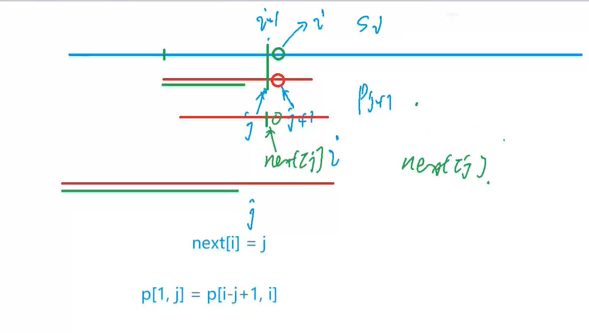
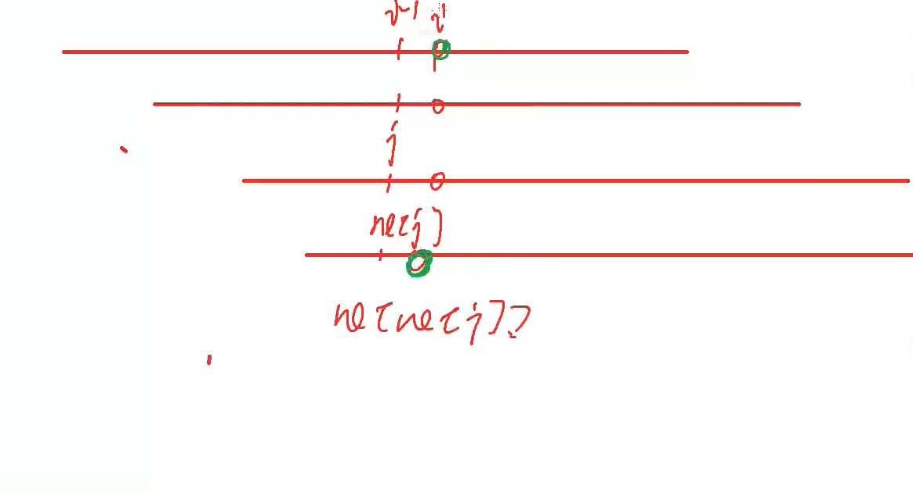

# AcWing 算法基础课 -- 数据结构

## AcWing 831. KMP字符串

`难度：简单`

### 题目描述

给定一个模式串S，以及一个模板串P，所有字符串中只包含大小写英文字母以及阿拉伯数字。

模板串P在模式串S中多次作为子串出现。

求出模板串P在模式串S中所有出现的位置的起始下标。

**输入格式**

第一行输入整数N，表示字符串P的长度。

第二行输入字符串P。

第三行输入整数M，表示字符串S的长度。

第四行输入字符串S。

**输出格式**

共一行，输出所有出现位置的起始下标（下标从0开始计数），整数之间用空格隔开。

**数据范围**

$1≤N≤10^5$

$1≤M≤10^6$


**输入样例：**

```R
3
aba
5
ababa
```

**输出样例：**

```R
0 2
```

### Solution

1. 暴力算法怎么做

```javascript
S[N], p[M];
for(int i = 1; i <= n; i++) {
    boolean flag = true;
    for(int j = 1; j <= m; j++) {
        if(s[i + j - 1] != p[j]) {
            flag = false;
            break;
        }
    }    
}
```

2. KMP 优化

```java
import java.util.*;
import java.io.*;

class Main{
    public static void main(String[] args) throws IOException{
        int N = 100010;
        int M = 1000010;
        int[] ne = new int[N];
        BufferedReader br = new BufferedReader(new InputStreamReader(System.in));
        BufferedWriter bw = new BufferedWriter(new OutputStreamWriter(System.out));
        Integer n = Integer.parseInt(br.readLine());
        String sp = " " + br.readLine();
        Integer m = Integer.parseInt(br.readLine());
        String ss = " " + br.readLine();
        char[] p = sp.toCharArray();
        char[] s = ss.toCharArray();
        
        for(int i = 2, j = 0; i <= n; i++) {
            while(j != 0 && p[i] != p[j + 1]) j = ne[j];
            if(p[i] == p[j + 1]) j++;
            ne[i] = j;
        }
        for(int i = 1, j = 0; i <= m; i++) {
            while(j != 0 && s[i] != p[j + 1]) j = ne[j];
            if(s[i] == p[j + 1]) j++;
            if(j == n) {
                bw.write(i - n + " ");
                j = ne[j];
            }
        }
        bw.close();
        br.close();
    }
}
```

### yxc

1. KMP 匹配过程



2. 求 next 数组



```cpp
#include <iostream>

using namespace std;

const int N = 100010, M = 1000010;

int n, m;
int ne[N];
char s[M], p[N];

int main()
{
    cin >> n >> p + 1 >> m >> s + 1;
	
    // 求 next 数组过程
    for (int i = 2, j = 0; i <= n; i ++ )
    {
        while (j && p[i] != p[j + 1]) j = ne[j];
        if (p[i] == p[j + 1]) j ++ ;
        ne[i] = j;
    }

    // kmp 匹配过程
    for (int i = 1, j = 0; i <= m; i ++ )
    {
        while (j && s[i] != p[j + 1]) j = ne[j];
        if (s[i] == p[j + 1]) j ++ ;
        if (j == n)
        {
            printf("%d ", i - n);
            j = ne[j];
        }
    }

    return 0;
}

// 作者：yxc
// 链接：https://www.acwing.com/activity/content/code/content/43108/
// 来源：AcWing
// 著作权归作者所有。商业转载请联系作者获得授权，非商业转载请注明出处。
```

