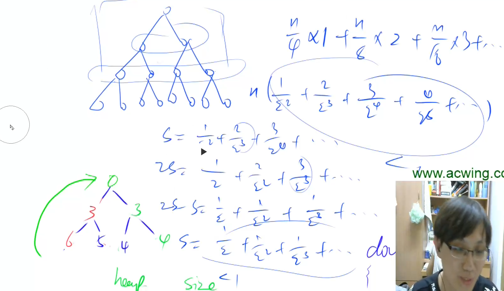

# AcWing 算法基础课 -- 数据结构

## AcWing 838. 堆排序

`难度：简单`

### 题目描述

输入一个长度为n的整数数列，从小到大输出前m小的数。

**输入格式**

第一行包含整数n和m。

第二行包含n个整数，表示整数数列。

**输出格式**

共一行，包含m个整数，表示整数数列中前m小的数。

**数据范围**

$1≤m≤n≤10^5$，
$1≤数列中元素≤10^9$

```r
5 3
4 5 1 3 2

输出样例：

1 2 3
```

### Solution

```java
import java.util.*;
import java.io.*;

public class Main{
    public static final int N = 100010;
    public static int[] h = new int[N];
    public static int cnt = 0;
    public static void main(String[] args) throws IOException{
        BufferedReader br = new BufferedReader(new InputStreamReader(System.in));
        BufferedWriter bw = new BufferedWriter(new OutputStreamWriter(System.out));
        String[] s = br.readLine().split(" ");
        int n = Integer.parseInt(s[0]);
        int m = Integer.parseInt(s[1]);
        s = br.readLine().split(" ");
        // 初始化
        for(int i = 1; i <= n; i++)  h[i] = Integer.parseInt(s[i - 1]);
        cnt = n;
        // 建堆，从 n / 2 开始建堆，可以把复杂度降低到 O(n)
        for(int i = n / 2; i > 0; i--)    down(i);
        while(m-- > 0){
            bw.write(h[1] + " ");
            h[1] = h[cnt];
            cnt--;
            down(1);
        }
        bw.close();
        br.close();
    }
    public static void down(int u){
        int t = u;
        // 找到 u 点和他左右孩子的三个的最小值
        // 如果左右孩子有比 u 小的，就互换，然后递归下去
        if(2 * u <= cnt && h[2 * u] < h[t]) t = 2 * u;
        if(2 * u + 1 <= cnt && h[2 * u + 1] < h[t]) t = 2 * u + 1;
        if(u != t){
            swap(u, t);
            down(t);
        }
    }
    public static void swap(int u, int t){
        int temp = h[u];
        h[u] = h[t];
        h[t] = temp;
    }
}
```

### yxc

下标从 1 开始比较好，从 0 开始的画， `2 * 0` 还是 0


从 `1 ~ n/2`开始建堆，时间复杂度为 `O(n)`，证明如下




```cpp
// h[N]存储堆中的值, h[1]是堆顶，x的左儿子是2x, 右儿子是2x + 1
// ph[k]存储第k个插入的点在堆中的位置
// hp[k]存储堆中下标是k的点是第几个插入的
int h[N], ph[N], hp[N], size;

// 交换两个点，及其映射关系
void heap_swap(int a, int b)
{
    swap(ph[hp[a]],ph[hp[b]]);
    swap(hp[a], hp[b]);
    swap(h[a], h[b]);
}

void down(int u)
{
    int t = u;
    if (u * 2 <= size && h[u * 2] < h[t]) t = u * 2;
    if (u * 2 + 1 <= size && h[u * 2 + 1] < h[t]) t = u * 2 + 1;
    if (u != t)
    {
        heap_swap(u, t);
        down(t);
    }
}

void up(int u)
{
    while (u / 2 && h[u] < h[u / 2])
    {
        heap_swap(u, u / 2);
        u >>= 1;
    }
}

// O(n)建堆
for (int i = n / 2; i; i -- ) down(i);

作者：yxc
链接：https://www.acwing.com/blog/content/404/
来源：AcWing
著作权归作者所有。商业转载请联系作者获得授权，非商业转载请注明出处。
```

