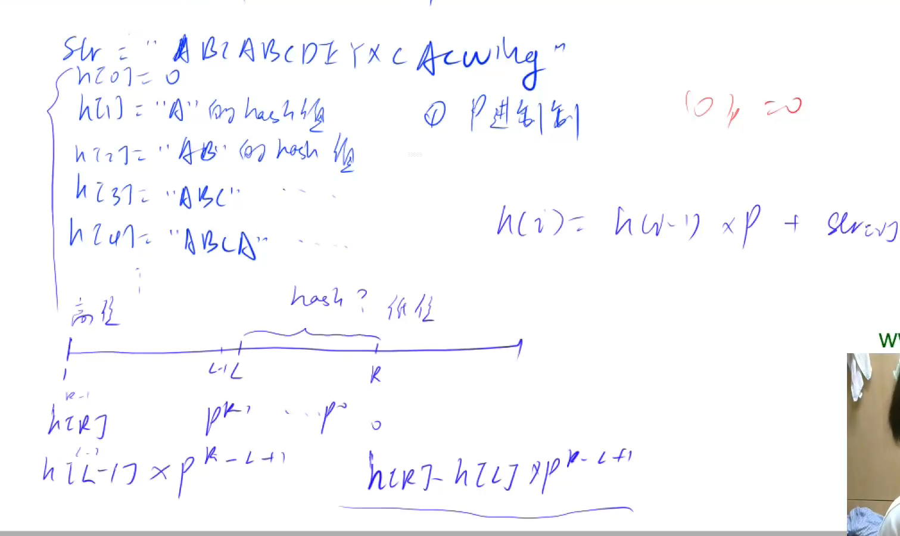

# AcWing 算法基础课 -- 数据结构

## AcWing 841. 字符串哈希 

`难度：简单`

### 题目描述

给定一个长度为n的字符串，再给定m个询问，每个询问包含四个整数l1,r1,l2,r2，请你判断[l1,r1]和[l2,r2

]这两个区间所包含的字符串子串是否完全相同。

字符串中只包含大小写英文字母和数字。

**输入格式**

第一行包含整数n和m，表示字符串长度和询问次数。

第二行包含一个长度为n的字符串，字符串中只包含大小写英文字母和数字。

接下来m行，每行包含四个整数l1,r1,l2,r2，表示一次询问所涉及的两个区间。

注意，字符串的位置从1开始编号。

**输出格式**

对于每个询问输出一个结果，如果两个字符串子串完全相同则输出“Yes”，否则输出“No”。

每个结果占一行。

**数据范围**

$1≤n,m≤10^5$

```r
输入样例：

8 3
aabbaabb
1 3 5 7
1 3 6 8
1 2 1 2

输出样例：

Yes
No
Yes
```

### Solution

```java
import java.util.*;
import java.io.*;

public class Main{
    public static final int N = 100010;
    // 进制为 131
    public static final int P = 131;
    // h[k] 存储字符串前 k 个字母的哈希值
    public static long[] h = new long[N];
    // p[k] 存储 P^k 
    public static long[] p = new long[N];
    public static long M = Long.MAX_VALUE;
    public static char[] sc;
    public static void main(String[] args) throws IOException{
        BufferedReader br = new BufferedReader(new InputStreamReader(System.in));
        BufferedWriter bw = new BufferedWriter(new OutputStreamWriter(System.out));
        String[] s = br.readLine().split(" ");
        int n = Integer.parseInt(s[0]);
        int m = Integer.parseInt(s[1]);
        sc = br.readLine().toCharArray();
        p[0] = 1;
        for(int i = 1; i <= n; i++){
            // h[i] = (h[i - 1] * P + sc[i - 1]) % M;
            // p[i] = (p[i - 1] * P) % M;
            h[i] = h[i - 1] * P + sc[i - 1];
            p[i] = p[i - 1] * P;
        }
        while(m-- > 0){
            s = br.readLine().split(" ");
            int l1 = Integer.parseInt(s[0]);
            int r1 = Integer.parseInt(s[1]);
            int l2 = Integer.parseInt(s[2]);
            int r2 = Integer.parseInt(s[3]);
            if(query(l1, r1) == query(l2, r2)) bw.write("Yes\n");
            else bw.write("No\n");
        }
        bw.close();
        br.close();
    }
    public static long query(int l, int r){
        return h[r] - h[l - 1] * p [r - l + 1];
    }
}
```

### yxc



```cpp
#include <iostream>
#include <algorithm>

using namespace std;

typedef unsigned long long ULL;

const int N = 100010, P = 131;

int n, m;
char str[N];
ULL h[N], p[N];

ULL get(int l, int r)
{
    return h[r] - h[l - 1] * p[r - l + 1];
}

int main()
{
    scanf("%d%d", &n, &m);
    scanf("%s", str + 1);

    p[0] = 1;
    for (int i = 1; i <= n; i ++ )
    {
        h[i] = h[i - 1] * P + str[i];
        p[i] = p[i - 1] * P;
    }

    while (m -- )
    {
        int l1, r1, l2, r2;
        scanf("%d%d%d%d", &l1, &r1, &l2, &r2);

        if (get(l1, r1) == get(l2, r2)) puts("Yes");
        else puts("No");
    }

    return 0;
}

// 作者：yxc
// 链接：https://www.acwing.com/activity/content/code/content/45313/
// 来源：AcWing
// 著作权归作者所有。商业转载请联系作者获得授权，非商业转载请注明出处。
```

