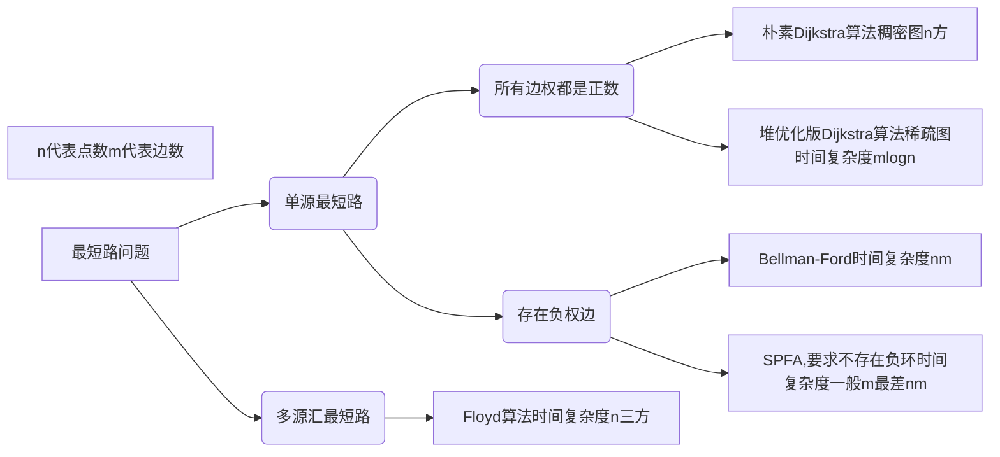
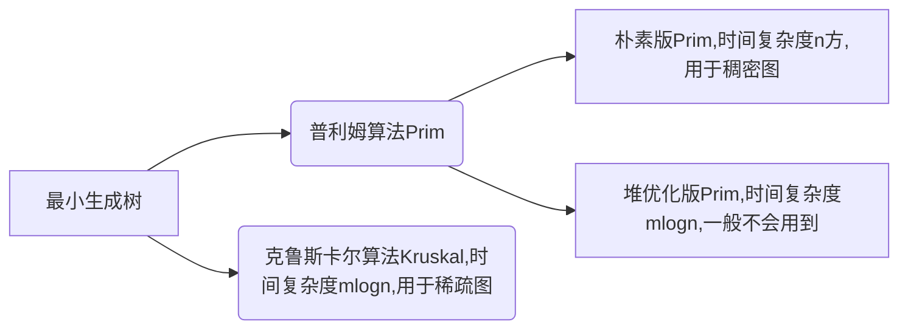
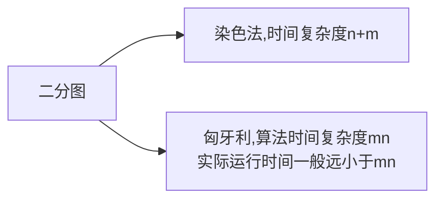

# AcWing 算法基础课 -- 搜索与图论

[TOC]

包括DFS，BFS，树与图的深度优先遍历，树与图的广度优先遍历，拓扑排序，Dijkstra，bellman-ford，spfa，Floyd，Prim，Kruskal，染色法判定二分图，匈牙利算法等内容。

## 题目

DFS
- [x] AcWing 842. 排列数字
- [x] AcWing 843. n-皇后问题

BFS
- [x] AcWing 844. 走迷宫
- [x] AcWing 845. 八数码

树与图的深度优先遍历
- [x] AcWing 846. 树的重心

树与图的广度优先遍历
- [x] AcWing 847. 图中点的层次

拓扑排序
- [x] AcWing 848. 有向图的拓扑序列

Dijkstra
- [x] AcWing 849. Dijkstra求最短路 I
- [ ] AcWing 850. Dijkstra求最短路 II

bellman-ford
- [x] AcWing 853. 有边数限制的最短路

spfa
- [x] AcWing 851. spfa求最短路
- [ ] AcWing 852. spfa判断负环

Floyd
- [x] AcWing 854. Floyd求最短路

Prim
- [x] AcWing 858. Prim算法求最小生成树

Kruskal
- [x] AcWing 859. Kruskal算法求最小生成树

染色法判定二分图
- [x] AcWing 860. 染色法判定二分图

匈牙利算法
- [x] AcWing 861. 二分图的最大匹配

## 模板

参考 AcWing [https://www.acwing.com/blog/content/405/](https://www.acwing.com/blog/content/405/)

### 框架总结

1. DFS 与 BFS

||数据结构|空间|性质|
|---|---|---|---|
|DFS|stack|$O(h)$|不具有最短性|
|BFS|queue|$O(2^n)$|最短路|

2. 最短路问题

最短路问题分为单源最短路和多源汇最短路。考察的侧重点在于从背景抽象建图，不在于算法的证明。

**一般用SPFA算法**



3. 最小生成树

**最小生成树一般处理无向图**，稠密图用朴素版prim算法，稀疏图用kruskal算法，一般堆优化的prim用的不多。 

最小生成树的用途：城市之间铺设电缆，保证电缆总长度最短，这就是最小生成树最短。



4. 二分图

**二分图性质：当且仅当图中不含奇数环。**

二分图用法：关押罪犯

染色法是如何判别一个图是不是二分图，其实就是一个DFS，时间复杂度O(n+m)。

匈牙利算法求二分图的最大匹配，时间复杂度O(mn)，实际运行时间一般远小于mn。



### 树与图的存储

树是一种特殊的图，与图的存储方式相同。图分有向图和无向图，对于无向图中的边ab，存储两条有向边a->b, b->a。所以只需要考虑有向图就可以了。

有向图的存储：邻接矩阵`g[a][b] 存储边a->b`或者邻接表

```cpp
// 邻接表存储图
// 对于每个点k，开一个单链表，存储k所有可以走到的点。h[k]存储这个单链表的头结点
int h[N], e[N], ne[N], idx;

// 添加一条边a->b
void add(int a, int b)
{
    e[idx] = b, ne[idx] = h[a], h[a] = idx ++ ;
}

// 初始化
idx = 0;
memset(h, -1, sizeof h);
```

### 树与图的遍历

时间复杂度 O(n+m), n 表示点数，m 表示边数

1. 深度优先遍历 —— 模板题 AcWing 846. 树的重心
```cpp
int dfs(int u)
{
    st[u] = true; // st[u] 表示点u已经被遍历过

    for (int i = h[u]; i != -1; i = ne[i])
    {
        int j = e[i];
        if (!st[j]) dfs(j);
    }
}
```
2. 宽度优先遍历 —— 模板题 AcWing 847. 图中点的层次
```cpp
queue<int> q;
st[1] = true; // 表示1号点已经被遍历过
q.push(1);

while (q.size())
{
    int t = q.front();
    q.pop();

    for (int i = h[t]; i != -1; i = ne[i])
    {
        int j = e[i];
        if (!st[j])
        {
            st[j] = true; // 表示点j已经被遍历过
            q.push(j);
        }
    }
}
```

### 拓扑排序 —— 模板题 AcWing 848. 有向图的拓扑序列

时间复杂度 O(n+m), n 表示点数，m 表示边数

**有向图才会有拓扑序列**，若一个由图中所有点构成的序列A满足：对于图中的每条边(x, y)，x在A中都出现在y之前，则称A是该图的一个拓扑序列。

```cpp
bool topsort()
{
    int hh = 0, tt = -1;

    // d[i] 存储点i的入度
    for (int i = 1; i <= n; i ++ )
        if (!d[i])
            q[ ++ tt] = i;

    while (hh <= tt)
    {
        int t = q[hh ++ ];

        for (int i = h[t]; i != -1; i = ne[i])
        {
            int j = e[i];
            if (-- d[j] == 0)
                q[ ++ tt] = j;
        }
    }

    // 如果所有点都入队了，说明存在拓扑序列；否则不存在拓扑序列。
    return tt == n - 1;
}
```

### 朴素dijkstra算法 —— 模板题 AcWing 849. Dijkstra求最短路 I

时间复杂是 $O(n^2+m)$, n 表示点数，m 表示边数

1. 思路
```r
初始化 dist[1] = 0, dist[i] = 正无穷
for n 次
    for 遍历每一个点
        找到未处理的距离起点的最小值 t
用 t 更新所有 dist[i]
```

2. 模板
```cpp
int g[N][N];  // 存储每条边
int dist[N];  // 存储1号点到每个点的最短距离
bool st[N];   // 存储每个点的最短路是否已经确定

// 求1号点到n号点的最短路，如果不存在则返回-1
int dijkstra()
{
    memset(dist, 0x3f, sizeof dist);
    dist[1] = 0;

    for (int i = 0; i < n; i ++ )
    {
        int t = -1;     // 在还未确定最短路的点中，寻找距离最小的点
        for (int j = 1; j <= n; j ++ )
            if (!st[j] && (t == -1 || dist[t] > dist[j]))
                t = j;

        // 用t更新其他点的距离
        for (int j = 1; j <= n; j ++ )
            dist[j] = min(dist[j], dist[t] + g[t][j]);

        st[t] = true;
    }

    if (dist[n] == 0x3f3f3f3f) return -1;
    return dist[n];
}
```

### 堆优化版dijkstra —— 模板题 AcWing 850. Dijkstra求最短路 II

时间复杂度 $O(mlogn)$, n 表示点数，m 表示边数

```cpp
typedef pair<int, int> PII;

int n;      // 点的数量
int h[N], w[N], e[N], ne[N], idx;       // 邻接表存储所有边
int dist[N];        // 存储所有点到1号点的距离
bool st[N];     // 存储每个点的最短距离是否已确定

// 求1号点到n号点的最短距离，如果不存在，则返回-1
int dijkstra()
{
    memset(dist, 0x3f, sizeof dist);
    dist[1] = 0;
    priority_queue<PII, vector<PII>, greater<PII>> heap;
    heap.push({0, 1});      // first存储距离，second存储节点编号

    while (heap.size())
    {
        auto t = heap.top();
        heap.pop();

        int ver = t.second, distance = t.first;

        if (st[ver]) continue;
        st[ver] = true;

        for (int i = h[ver]; i != -1; i = ne[i])
        {
            int j = e[i];
            if (dist[j] > distance + w[i])
            {
                dist[j] = distance + w[i];
                heap.push({dist[j], j});
            }
        }
    }

    if (dist[n] == 0x3f3f3f3f) return -1;
    return dist[n];
}
```

### Bellman-Ford算法 —— 模板题 AcWing 853. 有边数限制的最短路

时间复杂度 $O(nm)$, n 表示点数，m 表示边数

注意在模板题中需要对下面的模板稍作修改，加上备份数组，详情见模板题。

**一般 spfa 性能比 Bellman-Ford 好，只有特殊情况下用 Bellman-Ford 算法**

1. 思路
```r
for n 次
    for 所有边 a,b,w
        dist[b] = min(dist[b], dist[a] + w)
```

2. 模板
```cpp
int n, m;       // n表示点数，m表示边数
int dist[N];        // dist[x]存储1到x的最短路距离

struct Edge     // 边，a表示出点，b表示入点，w表示边的权重
{
    int a, b, w;
}edges[M];

// 求1到n的最短路距离，如果无法从1走到n，则返回-1。
int bellman_ford()
{
    memset(dist, 0x3f, sizeof dist);
    dist[1] = 0;

    // 如果第n次迭代仍然会松弛三角不等式，就说明存在一条长度是n+1的最短路径，由抽屉原理，路径中至少存在两个相同的点，说明图中存在负权回路。
    for (int i = 0; i < n; i ++ )
    {
        for (int j = 0; j < m; j ++ )
        {
            int a = edges[j].a, b = edges[j].b, w = edges[j].w;
            if (dist[b] > dist[a] + w)
                dist[b] = dist[a] + w;
        }
    }

    if (dist[n] > 0x3f3f3f3f / 2) return -1;
    return dist[n];
}
```

### spfa 算法（队列优化的Bellman-Ford算法） —— 模板题 AcWing 851. spfa求最短路

时间复杂度 平均情况下 $O(m)$，最坏情况下 $O(nm)$, n 表示点数，m 表示边数

要求不存在负环，**一般 spfa 性能比 Bellman-Ford 好，只有特殊情况下用 Bellman-Ford 算法**。


1. 思路
```r
# spfa 就是 bellman-ford 算法加上宽搜优化
# dist[b] = min(dist[b], dist[a] + w) 可以发现只有 dist[a] 变小了，dist[b] 才会变小
q.add(1);
while(q不空)
    1. t = q.pop();
    2. 更新 t 的所有出边，把出边指向的顶点入队

```

2. 模板

```cpp
int n;      // 总点数
int h[N], w[N], e[N], ne[N], idx;       // 邻接表存储所有边
int dist[N];        // 存储每个点到1号点的最短距离
bool st[N];     // 存储每个点是否在队列中

// 求1号点到n号点的最短路距离，如果从1号点无法走到n号点则返回-1
int spfa()
{
    memset(dist, 0x3f, sizeof dist);
    dist[1] = 0;

    queue<int> q;
    q.push(1);
    st[1] = true;

    while (q.size())
    {
        auto t = q.front();
        q.pop();

        st[t] = false;

        for (int i = h[t]; i != -1; i = ne[i])
        {
            int j = e[i];
            if (dist[j] > dist[t] + w[i])
            {
                dist[j] = dist[t] + w[i];
                if (!st[j])     // 如果队列中已存在j，则不需要将j重复插入
                {
                    q.push(j);
                    st[j] = true;
                }
            }
        }
    }

    if (dist[n] == 0x3f3f3f3f) return -1;
    return dist[n];
}
```

### spfa判断图中是否存在负环 —— 模板题 AcWing 852. spfa判断负环

时间复杂度是 $O(nm)$, n 表示点数，m 表示边数

```cpp
int n;      // 总点数
int h[N], w[N], e[N], ne[N], idx;       // 邻接表存储所有边
int dist[N], cnt[N];        // dist[x]存储1号点到x的最短距离，cnt[x]存储1到x的最短路中经过的点数
bool st[N];     // 存储每个点是否在队列中

// 如果存在负环，则返回true，否则返回false。
bool spfa()
{
    // 不需要初始化dist数组
    // 原理：如果某条最短路径上有n个点（除了自己），那么加上自己之后一共有n+1个点，由抽屉原理一定有两个点相同，所以存在环。

    queue<int> q;
    for (int i = 1; i <= n; i ++ )
    {
        q.push(i);
        st[i] = true;
    }

    while (q.size())
    {
        auto t = q.front();
        q.pop();

        st[t] = false;

        for (int i = h[t]; i != -1; i = ne[i])
        {
            int j = e[i];
            if (dist[j] > dist[t] + w[i])
            {
                dist[j] = dist[t] + w[i];
                cnt[j] = cnt[t] + 1;
                if (cnt[j] >= n) return true;       // 如果从1号点到x的最短路中包含至少n个点（不包括自己），则说明存在环
                if (!st[j])
                {
                    q.push(j);
                    st[j] = true;
                }
            }
        }
    }

    return false;
}
```

### floyd算法 —— 模板题 AcWing 854. Floyd求最短路

时间复杂度是 $O(n^3)$, n 表示点数

```cpp
// 初始化：
    for (int i = 1; i <= n; i ++ )
        for (int j = 1; j <= n; j ++ )
            if (i == j) d[i][j] = 0;
            else d[i][j] = INF;

// 算法结束后，d[a][b]表示a到b的最短距离
void floyd()
{
    for (int k = 1; k <= n; k ++ )
        for (int i = 1; i <= n; i ++ )
            for (int j = 1; j <= n; j ++ )
                d[i][j] = min(d[i][j], d[i][k] + d[k][j]);
}
```

### 朴素版prim算法 —— 模板题 AcWing 858. Prim算法求最小生成树

时间复杂度是 $O(n^2+m)$, n 表示点数，m 表示边数

最小生成树的用途：城市之间铺设电缆，保证电缆总长度最短，这就是最小生成树最短。

1. 思路

集合：是指当前已经在连通块中的点

t点到集合的距离定义：t点到集合中所有点的距离最小值。

最小生成树的边：t 对应集合的那条边
```r
dist[i] = INF;
for n  次
    t 找到集合外距离最近的点
    用 t 更新其他点到 集合 的距离
    flag[t] = true
```

2. 模板
```cpp
int n;      // n表示点数
int g[N][N];        // 邻接矩阵，存储所有边
int dist[N];        // 存储其他点到当前最小生成树的距离
bool st[N];     // 存储每个点是否已经在生成树中


// 如果图不连通，则返回INF(值是0x3f3f3f3f), 否则返回最小生成树的树边权重之和
int prim()
{
    memset(dist, 0x3f, sizeof dist);

    int 0； = 0;
    for (int i = 0; i < n; i ++ )
    {
        int t = -1;
        for (int j = 1; j <= n; j ++ )
            if (!st[j] && (t == -1 || dist[t] > dist[j]))
                t = j;

        if (i && dist[t] == INF) return INF;

        if (i) res += dist[t];
        st[t] = true;

        for (int j = 1; j <= n; j ++ ) dist[j] = min(dist[j], g[t][j]);
    }

    return res;
}
```

### Kruskal算法 —— 模板题 AcWing 859. Kruskal算法求最小生成树

时间复杂度是 $O(mlogm)$, n 表示点数，m 表示边数

1. 模板

第一步用快排时间复杂度是mlogm；第二步用并查集，复杂度是m
```r
1. 将所有边按权重从小到大排序
2. 枚举每条边 a，b，c
    if a,b 不连通
        将这条边加入集合
```
2. 代码
```cpp
int n, m;       // n是点数，m是边数
int p[N];       // 并查集的父节点数组

struct Edge     // 存储边
{
    int a, b, w;

    bool operator< (const Edge &W)const
    {
        return w < W.w;
    }
}edges[M];

int find(int x)     // 并查集核心操作
{
    if (p[x] != x) p[x] = find(p[x]);
    return p[x];
}

int kruskal()
{
    sort(edges, edges + m);

    for (int i = 1; i <= n; i ++ ) p[i] = i;    // 初始化并查集

    int res = 0, cnt = 0;
    for (int i = 0; i < m; i ++ )
    {
        int a = edges[i].a, b = edges[i].b, w = edges[i].w;

        a = find(a), b = find(b);
        if (a != b)     // 如果两个连通块不连通，则将这两个连通块合并
        {
            p[a] = b;
            res += w;
            cnt ++ ;
        }
    }

    if (cnt < n - 1) return INF;
    return res;
}
```

### 染色法判别二分图 —— 模板题 AcWing 860. 染色法判定二分图

时间复杂度是 $O(n+m)$, n 表示点数，m 表示边数
1. 思路

**二分图性质：当且仅当图中不含奇数环。**

```r
基于DFS染色，如果染色出现矛盾就不是二分图，否则就是二分图。
```
2. 模板
```cpp
int n;      // n表示点数
int h[N], e[M], ne[M], idx;     // 邻接表存储图
int color[N];       // 表示每个点的颜色，-1表示未染色，0表示白色，1表示黑色

// 参数：u表示当前节点，c表示当前点的颜色
bool dfs(int u, int c)
{
    color[u] = c;
    for (int i = h[u]; i != -1; i = ne[i])
    {
        int j = e[i];
        if (color[j] == -1)
        {
            if (!dfs(j, !c)) return false;
        }
        else if (color[j] == c) return false;
    }

    return true;
}

bool check()
{
    memset(color, -1, sizeof color);
    bool flag = true;
    for (int i = 1; i <= n; i ++ )
        if (color[i] == -1)
            if (!dfs(i, 0))
            {
                flag = false;
                break;
            }
    return flag;
}
```

### 匈牙利算法 —— 模板题 AcWing 861. 二分图的最大匹配

时间复杂度是 $O(nm)$, n 表示点数，m 表示边数

```cpp
int n1, n2;     // n1表示第一个集合中的点数，n2表示第二个集合中的点数
int h[N], e[M], ne[M], idx;     // 邻接表存储所有边，匈牙利算法中只会用到从第一个集合指向第二个集合的边，所以这里只用存一个方向的边
int match[N];       // 存储第二个集合中的每个点当前匹配的第一个集合中的点是哪个
bool st[N];     // 表示第二个集合中的每个点是否已经被遍历过

bool find(int x)
{
    for (int i = h[x]; i != -1; i = ne[i])
    {
        int j = e[i];
        if (!st[j])
        {
            st[j] = true;
            if (match[j] == 0 || find(match[j]))
            {
                match[j] = x;
                return true;
            }
        }
    }

    return false;
}

// 求最大匹配数，依次枚举第一个集合中的每个点能否匹配第二个集合中的点
int res = 0;
for (int i = 1; i <= n1; i ++ )
{
    memset(st, false, sizeof st);
    if (find(i)) res ++ ;
}
```